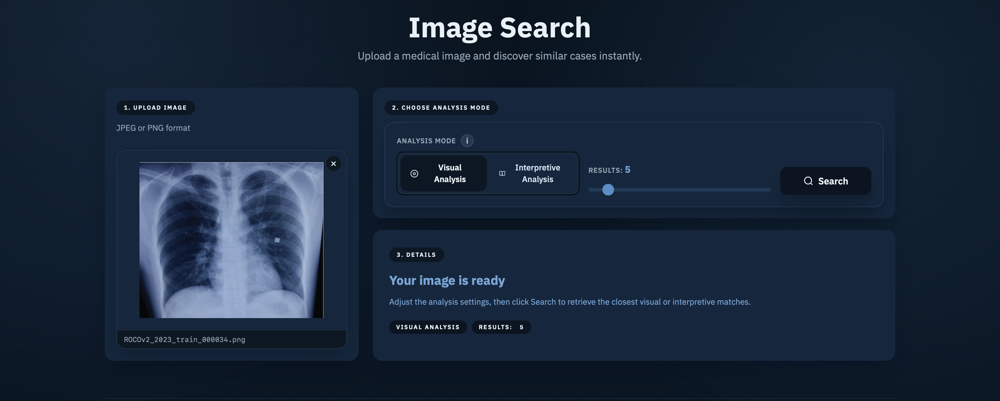
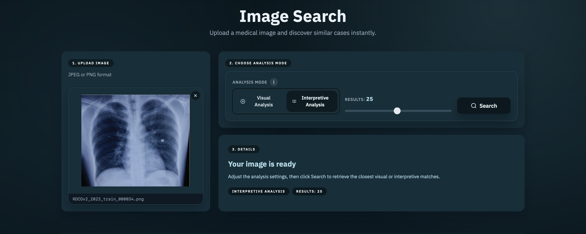
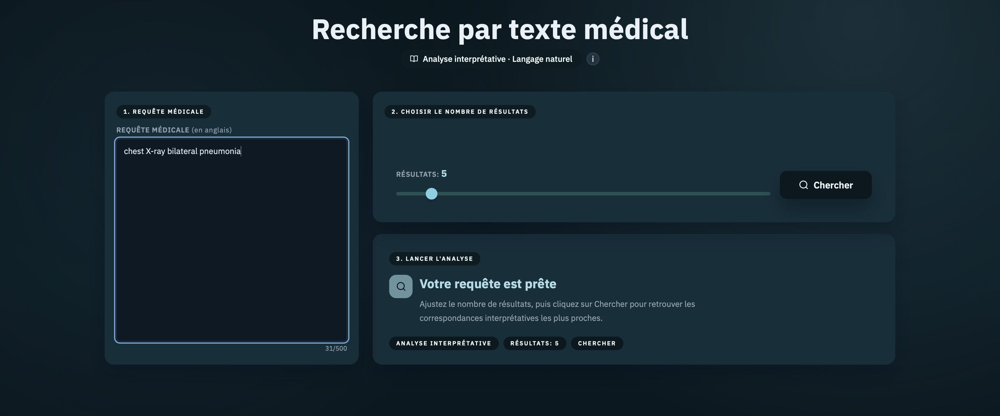
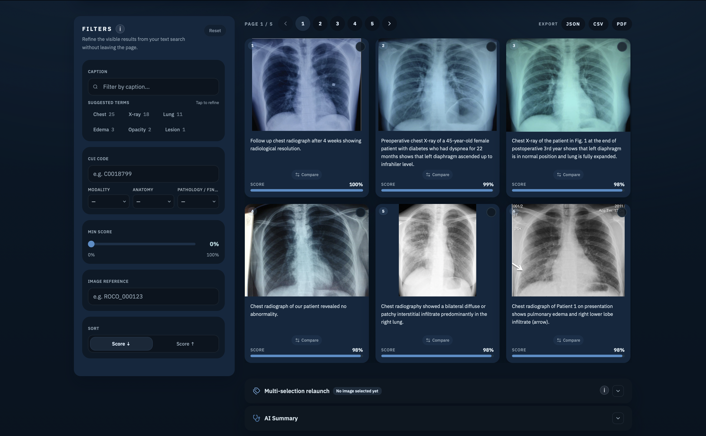
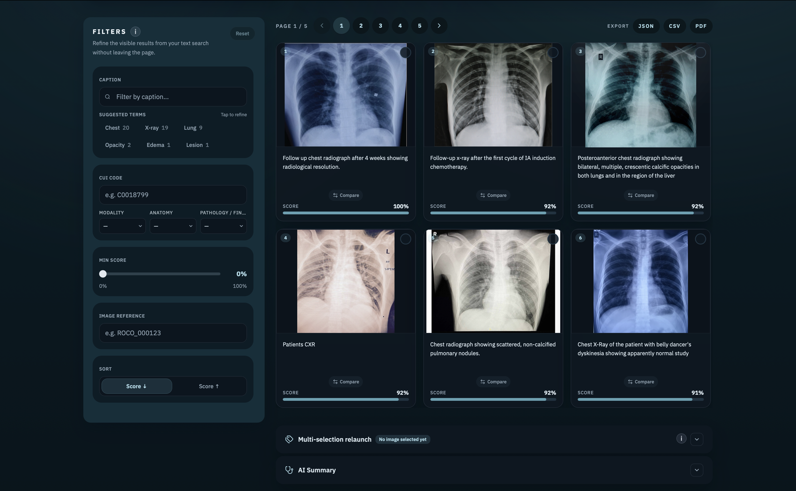
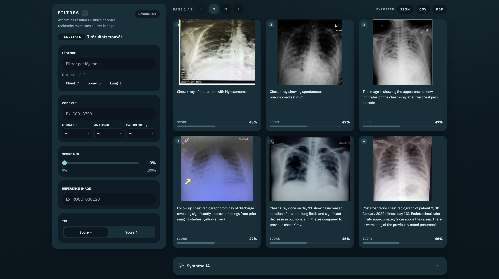
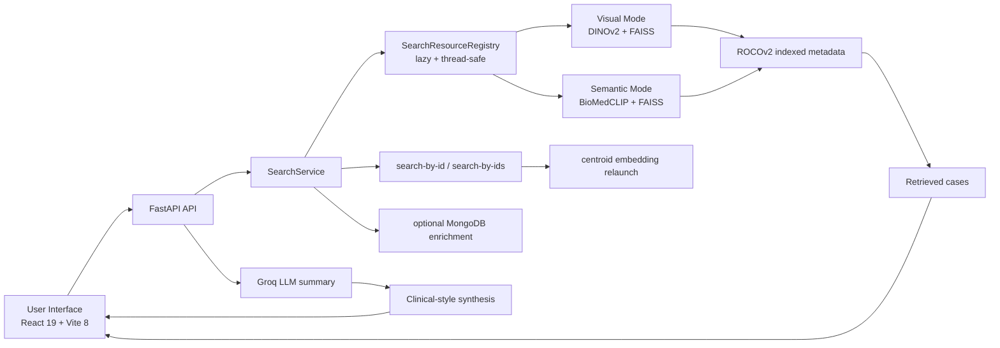

# MediScan AI

<div align="center">
  

  <h3>Multimodal medical retrieval platform built for visual search, semantic search, and AI-assisted interpretation.</h3>

  <p>
    <strong>FastAPI</strong> · <strong>React 19</strong> · <strong>Vite 8</strong> · <strong>FAISS</strong> · <strong>DINOv2</strong> · <strong>BioMedCLIP</strong> · <strong>Groq LLM</strong>
  </p>

  <p>
    
    
    
    
    
    
    
    
    
  </p>

  <p>
    <strong>Non-clinical academic prototype.</strong><br />
    Designed as a polished end-to-end product demo for medical image retrieval and explainable exploration workflows.
  </p>
</div>

---

## Product Preview

<p align="center">
  
  
  
</p>

<p align="center">
  <em>Three complementary user journeys: image-to-image retrieval, semantic interpretation, and text-to-image exploration.</em>
</p>

---

## What MediScan AI Is

MediScan AI is a full-stack multimodal retrieval system for medical imaging. It lets a user:

- search from an uploaded medical image
- search from a clinical text description
- relaunch a search from one result or from multiple selected results
- compare retrieved cases visually
- generate an AI clinical-style synthesis from the retrieved evidence
- browse everything inside a polished bilingual product interface with light and dark themes

This repository is not just a model wrapper. It demonstrates product thinking, model integration, evaluation discipline, API design, UI engineering, and retrieval system architecture in one coherent project.

---

## Why This Project Stands Out

| Dimension | What is implemented |
|---|---|
| Multimodal retrieval | Dedicated visual and semantic search modes backed by separate FAISS indexes |
| Real product UX | Responsive React interface, bilingual copy, polished search flows, result comparison, export, guided interactions |
| Retrieval engineering | Stable artifact configuration, typed runtime modes, lazy loading, thread-safe resource registry, centroid relaunch from selected images |
| AI augmentation | Groq-powered clinical summary generation from top-ranked results |
| Evaluation rigor | Standard, strict, typed, CUI, relaunch, text, and benchmark scripts |
| Deployment realism | One-command startup scripts, environment-based configuration, Git LFS artifact strategy |

---

## Core User Flows

### 1. Visual Similarity Retrieval

Upload a radiology image and retrieve nearest neighbors through visual embedding search powered by DINOv2 and FAISS.

### 2. Semantic Similarity Retrieval

Use BioMedCLIP to retrieve medically relevant images from language-based descriptions, not just pixel-level resemblance.

### 3. Text-to-Image Search

Enter a clinical prompt in free text and explore relevant cases through the semantic index.

### 4. Multi-Selection Relaunch

Select several strong matches, build a centroid embedding, and relaunch retrieval from the combined signal.

### 5. AI Summary Generation

Generate a cautious synthesis from top results through Groq, directly integrated into the retrieval workflow.

---

## Demo Gallery

<table>
  <tr>
    <td align="center" width="33%">
      <br />
      <strong>Visual search</strong><br />
      Retrieve similar exams from an image query.
    </td>
    <td align="center" width="33%">
      <br />
      <strong>Semantic search</strong><br />
      Explore medically aligned neighbors from meaning, not only appearance.
    </td>
    <td align="center" width="33%">
      <br />
      <strong>Text search</strong><br />
      Start from a clinical description and surface related image cases.
    </td>
  </tr>
</table>

---

## Technical Skills Demonstrated

This project is a strong showcase of advanced technical capabilities across the stack.

### Applied ML and Retrieval Engineering

- multimodal embedding strategy with separate visual and semantic pipelines
- FAISS index management with stable manifests and explicit mode configuration
- text-to-image retrieval using BioMedCLIP
- image-to-image retrieval using DINOv2
- centroid-based relaunch from multiple retrieved images
- rigorous evaluation design with strict and standard protocols

### Backend Architecture

- FastAPI API surface for upload, text search, search-by-id, search-by-ids, AI summary, contact, and media redirection
- lazy loading of heavy retrieval resources on first request
- thread-safe shared registry for FAISS indexes and embedders
- structured validation around content type, upload size, text input, mode normalization, and selection constraints
- optional metadata enrichment via MongoDB

### Frontend Product Engineering

- React 19 + Vite 8 application with a real product-level interface
- advanced search UX across image and text workflows
- dual theme system, bilingual interface, and polished component styling
- modal comparison flows, result detail flows, export actions, guided interaction cues
- reusable carousel-driven marketing surface and coherent product storytelling

### Engineering Discipline

- one-command startup for frontend + backend
- Git LFS strategy for large FAISS artifacts
- test and evaluation tooling separated from runtime
- measurable retrieval quality backed by reproducible scripts and proof files

If the goal is to show your profile on GitHub, this repo signals much more than "I can build an app". It shows that you can design, integrate, evaluate, productize, and present a technically complex AI system end-to-end.

---

## Architecture Overview



---

## Retrieval Evidence

The project includes a complete evaluation layer documented in [`docs/evaluation.md`](docs/evaluation.md).

### Dataset and benchmark base

| Item | Value |
|---|---|
| Dataset | ROCOv2 |
| Indexed images | 59,962 |
| Standard benchmark queries | 1,999 |
| Strict benchmark annotated subset | 12,251 images |
| Main target metric | `TMO_resultats` |

### Selected benchmark results

| Mode | Standard `TMO_resultats` | Strict `TMO_resultats` | Standard `Precision@K (CUI)` |
|---|---:|---:|---:|
| Visual | 40.7% | 86.3% | 92.3% |
| Semantic | 45.7% | 90.4% | 93.9% |

### Why this matters

- the semantic mode wins on the main retrieval relevance metric
- the evaluation is not hand-wavy: it is script-backed and reproducible
- the repo already includes an explicit path for further model tuning and benchmarking

For full details, see [`docs/evaluation.md`](docs/evaluation.md) and the proof files in [`proofs/`](proofs).

---

## Product Features

| Feature | Description |
|---|---|
| Image upload search | Search from a PNG or JPEG medical image |
| Text search | Search from a clinical text description |
| Search by result ID | Relaunch from an existing case |
| Multi-image relaunch | Use several selected results as a combined query |
| AI summary | Generate a clinical-style synthesis through Groq |
| Result comparison | Compare query and retrieved image in dedicated modal flows |
| Export | Export results as JSON, CSV, or PDF |
| Responsive UI | Product-grade interface for desktop and mobile |
| Theme support | Light and dark themes |
| Internationalization | French and English UI support |

---

## API Surface

| Endpoint | Purpose |
|---|---|
| `GET /api/health` | API health check |
| `POST /api/search` | image upload retrieval |
| `POST /api/search-text` | text-to-image retrieval |
| `POST /api/search-by-id` | relaunch from one indexed image |
| `POST /api/search-by-ids` | relaunch from multiple selected images |
| `POST /api/generate-conclusion` | generate AI synthesis |
| `POST /api/contact` | contact form delivery |
| `GET /api/images/{image_id}` | redirect to public image asset |

---

## Quick Start

### Prerequisites

- Python `3.11`
- Node.js `>= 20.19.0` or `>= 22.12.0`
- npm
- Git LFS

### 1. Clone and pull large artifacts

```bash
git clone https://github.com/OzanTaskin/mediscan-cbir.git
cd mediscan-cbir
git lfs install
git lfs pull
```

### 2. Configure environment

```bash
cp .env.example .env
```

If you want AI summary generation, set:

```env
GROQ_KEY_API=your_groq_api_key_here
```

### 3. Run everything

#### macOS / Linux

```bash
chmod +x run.sh
./run.sh
```

#### Windows

```bat
run.bat
```

### 4. Open the app

- Frontend: `http://127.0.0.1:5173`
- Backend: `http://127.0.0.1:8000`
- Health check: `http://127.0.0.1:8000/api/health`

---

## Developer Commands

### Frontend

```bash
cd frontend
npm ci
npm run dev
npm run lint
npm run build
```

### Backend

```bash
python3.11 -m venv .venv311
source .venv311/bin/activate
pip install -r requirements.txt
PYTHONPATH=src uvicorn backend.app.main:app --host 127.0.0.1 --port 8000
```

### Tests

```bash
pytest
```

---

## Repository Map

```text
.
├── backend/           FastAPI app, API routes, services
├── frontend/          React product interface and marketing surface
├── src/mediscan/      retrieval runtime, embedders, indexing utilities
├── artifacts/         FAISS indexes, ids, manifests
├── scripts/           evaluation and benchmarking scripts
├── tests/             Python test suite
├── proofs/            benchmark outputs and evaluation evidence
├── docs/              project documentation and evaluation reports
├── run.sh / run.bat   one-command local startup
└── README.md          this product-facing overview
```

---

## What This README Is Optimized For

This README is intentionally written as a GitHub presentation layer.

It is designed to help a reviewer, recruiter, collaborator, professor, or client immediately understand:

- what the product does
- why the technical architecture is serious
- what engineering depth is inside the repo
- what kind of technical profile the author brings

---

## Disclaimer

MediScan AI is a **non-clinical academic prototype**.

It is intended for experimentation, retrieval research, interface design, and AI product engineering demonstration. It must not be used as a medical device or as a substitute for clinical judgment.
