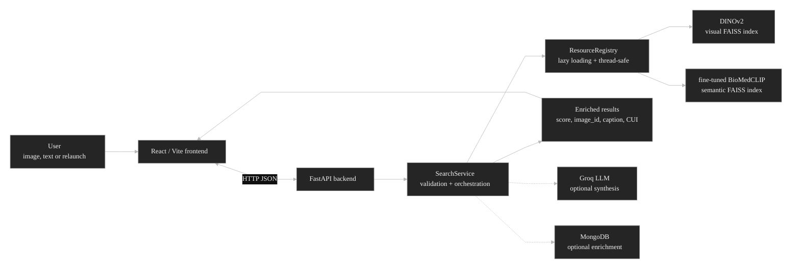
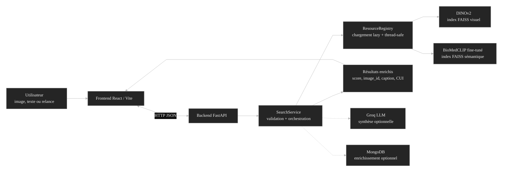

# MEDISCAN AI

<p align="center">
  <strong>English</strong> · <a href="#francais">Français</a>
</p>

<div align="center">
  

  <h3>Multimodal medical image retrieval platform.</h3>

  <p>
    MEDISCAN AI makes it possible to search, compare and explore medical images from an image, a text query or a semantic representation.
  </p>

  <p>
    <strong>Non-clinical academic prototype.</strong><br />
    This repository is built to experiment with a medical image retrieval system. It must not be used as a medical device or as a diagnostic tool.
  </p>

  <p>
    
    
    
    
    
    
    
    
  </p>

  <h3>Technical Stack</h3>

  <table border="1" cellpadding="16" cellspacing="0">
    <tr>
      <td width="33%" valign="top" align="center">
        <h4>CBIR / AI Core</h4>
        <p><sub>Embeddings, indexing and multimodal retrieval</sub></p>
        <p align="center">
          &nbsp;&nbsp;<strong>PyTorch</strong><br /><br />
          &nbsp;&nbsp;<strong>BioMedCLIP / Hugging Face</strong><br /><br />
          &nbsp;&nbsp;<strong>DINOv2 / FAISS</strong><br /><br />
          &nbsp;&nbsp;<strong>ROCOv2 / datasets</strong>
        </p>
      </td>
      <td width="33%" valign="top" align="center">
        <h4>Backend / API</h4>
        <p><sub>Services, validation, orchestration and synthesis</sub></p>
        <p align="center">
          &nbsp;&nbsp;<strong>Python 3.11</strong><br /><br />
          &nbsp;&nbsp;<strong>FastAPI</strong><br /><br />
          &nbsp;&nbsp;<strong>MongoDB / PyMongo</strong><br /><br />
          &nbsp;&nbsp;<strong>Groq Cloud</strong>
        </p>
      </td>
      <td width="33%" valign="top" align="center">
        <h4>Frontend / Product</h4>
        <p><sub>Interface, user flows and GitHub demo</sub></p>
        <p align="center">
          &nbsp;&nbsp;<strong>React 19</strong><br /><br />
          &nbsp;&nbsp;<strong>Vite</strong><br /><br />
          &nbsp;&nbsp;<strong>Tailwind CSS</strong><br /><br />
          &nbsp;&nbsp;<strong>Vitest / Pytest</strong>
        </p>
      </td>
    </tr>
  </table>

  <p>
    <small><strong>Other building blocks:</strong> Uvicorn, NumPy, Pillow, OpenCLIP, evaluation scripts and versioned FAISS artifacts.</small>
  </p>

  <p>
    <strong>Top contributors</strong>
  </p>

  <table border="0" cellpadding="8" cellspacing="0">
    <tr>
      <td align="center" width="96">
        <a href="https://github.com/OzanTaskin" title="OzanTaskin">
          <br />
          <sub>OzanTaskin</sub>
        </a>
      </td>
      <td align="center" width="96">
        <a href="https://github.com/Somixe" title="Somixe">
          <br />
          <sub>Somixe</sub>
        </a>
      </td>
      <td align="center" width="96">
        <a href="https://github.com/ales-frhn" title="ales-frhn">
          <br />
          <sub>ales-frhn</sub>
        </a>
      </td>
      <td align="center" width="96">
        <a href="https://github.com/RayaneWebDev" title="RayaneWebDev">
          <br />
          <sub>RayaneWebDev</sub>
        </a>
      </td>
    </tr>
  </table>
</div>

## Table of Contents

- [Overview](#overview)
- [Documentation](#documentation)
- [Application Demo](#application-demo)
- [1. Features](#1-features)
  - [1.1 Overview](#11-overview)
  - [1.2 Search Modes](#12-search-modes)
  - [1.3 Main Features](#13-main-features)
  - [1.4 Highlighted Features](#14-highlighted-features)
- [2. Technical Architecture](#2-technical-architecture)
  - [2.1 Overview](#21-overview)
  - [2.2 Why DINOv2 and BioMedCLIP](#22-why-dinov2-and-biomedclip)
  - [2.3 Fine-tuning BioMedCLIP on ROCOv2](#23-fine-tuning-biomedclip-on-rocov2)
  - [2.4 Search Pipeline](#24-search-pipeline)
  - [2.5 Backend API](#25-backend-api)
  - [2.6 API Contracts](#26-api-contracts)
  - [2.7 Evaluation and Proofs](#27-evaluation-and-proofs)
- [3. Run and Relaunch Locally](#3-run-and-relaunch-locally)
- [4. Project Structure](#4-project-structure)
- [Known Limitations](#known-limitations)
- [License](#license)
- [Disclaimer](#disclaimer)

## Overview

> This section introduces the project, its general objective and the three ways to query the medical image database.

MEDISCAN AI is an academic prototype dedicated to medical image retrieval. The application can query an image database from a reference image, a text query or a semantic representation.

The project explores the use of visual and multimodal models to browse a collection of medical images. The application brings together upload, result display, filters, comparison, search relaunch and assisted synthesis.

The project covers four areas:

- fast exploration of medical image databases;
- visual and semantic comparison of results;
- a user interface around an AI retrieval engine;
- locally executable code with frontend, backend, indexes and evaluation scripts.

By combining image search, text search, multimodal models and a user interface, MEDISCAN AI shows how to organize an end-to-end medical retrieval system.

Three types of search are available:

- image-based search, to retrieve visually similar images;
- semantic search, to identify medically related images;
- text-based search, to retrieve images matching a description or clinical intent.

## Documentation

The project documentation can be generated as a single local portal:

```bash
python scripts/generate_docs.py
```

Or through the project shell shortcut:

```bash
./bin/run.sh docs
```

The generated portal is located here:

```text
docs/index.html
```

## Application Demo

> This section shows the real user flow, from choosing the search mode to assisted synthesis.

[Watch the demo video on YouTube](https://youtu.be/sy-FLL0Jk4w)


The video shows a usage scenario:

1. Choose the search mode.
2. Upload a medical image or enter a text query.
3. Display the results.
4. Explore and compare images.
5. Relaunch a search from one or more results.
6. Generate an LLM-assisted synthesis.

## 1. Features

> This section summarizes the main actions available in the interface.

### 1.1 Overview

> This subsection presents the general user-side workflow.

MEDISCAN AI makes it possible to search, compare and explore medical images without directly manipulating models or indexes.

**Main actions:**

- search by image or by text;
- browse, filter and inspect results;
- relaunch a search from one result or a selection;
- generate an assisted synthesis and present the results.

The interface sends requests to the backend, receives ranked results and displays useful metadata.

### 1.2 Search Modes

> This subsection presents the three ways to query the database.

<table border="1" cellpadding="12" cellspacing="0">
  <tr>
    <td width="33%" valign="top">
      
      <br /><br />
      <strong>Visual similarity</strong><br />
      Input: medical image<br />
      Result: images close in appearance.
    </td>
    <td width="33%" valign="top">
      
      <br /><br />
      <strong>Semantic proximity</strong><br />
      Input: medical image<br />
      Result: images close in medical meaning.
    </td>
    <td width="33%" valign="top">
      
      <br /><br />
      <strong>Description-based search</strong><br />
      Input: text query<br />
      Result: images aligned with the text.
    </td>
  </tr>
</table>

### 1.3 Main Features

> This subsection groups features by major families.

<table border="1" cellpadding="14" cellspacing="0">
  <tr>
    <td width="50%" valign="top">
      
      <br /><br />
      <strong>Medical image upload</strong><br />
      Import a reference image.
      <br /><br />
      <strong>Visual, semantic and text-to-image search</strong><br />
      Three modes to explore the database.
      <br /><br />
      <strong>Filters and categories</strong><br />
      Refinement by score, caption, CUI, medical type or reference.
    </td>
    <td width="50%" valign="top">
      
      <br /><br />
      <strong>Results grid</strong><br />
      Ranked, paginated results that are easy to compare.
      <br /><br />
      <strong>Detail view</strong><br />
      Inspect an image with its useful information.
      <br /><br />
      <strong>Relaunch from one or more results</strong><br />
      Start a new search from one result or a selection.
    </td>
  </tr>
  <tr>
    <td width="50%" valign="top">
      
      <br /><br />
      <strong>LLM-assisted conclusion</strong><br />
      Exploratory summary generated from the results.
      <br /><br />
      <strong>Export and sharing</strong><br />
      Present results for comparison, review or demonstration.
    </td>
    <td width="50%" valign="top">
      
      <br /><br />
      <strong>Bilingual interface</strong><br />
      Browse in multiple languages.
      <br /><br />
      <strong>Light / dark theme</strong><br />
      Visual adaptation to the usage context.
      <br /><br />
      <strong>User journey</strong><br />
      Continuous workflow from upload to synthesis.
    </td>
  </tr>
</table>

### 1.4 Highlighted Features

> This subsection details the key steps of the exploration workflow.

#### 1. Paginated Results Grid

After a search, images are displayed in a paginated grid ranked by similarity. Each result shows the essential information: rank, image, score, caption and identifier.

#### 2. Result Filters

Filters refine the list already returned by the search engine. They do not recompute embeddings: they reduce or organize the visible results.

Main filters:

- **caption and suggestions**: search for terms inside captions and suggest useful words;
- **CUI and medical type**: filter by UMLS concepts, anatomy, modality or finding;
- **score and sorting**: minimum threshold and result order;
- **image reference**: targeted search for a precise identifier, for example `ROCO_000123`.

In practice, a user can start from a broad search, choose a medical category, then refine with a term extracted from captions and a minimum score.

#### 3. Search Relaunch

Relaunching turns an interesting result, or a selection of several images, into a new query. With a multi-image selection, embeddings are averaged to represent the shared trend of the group.

Use cases:

- go deeper after finding a relevant image;
- search for cases close to a group of similar images;
- move from broad exploration to a more targeted search.

#### 4. LLM Conclusion

The LLM conclusion generates a cautious synthesis from the captions of similar images. It helps summarize recurring patterns without making a diagnosis or replacing medical advice. It requires a Groq key configured in `.env`.

#### 5. Export and Sharing

Results can be kept or shared to preserve the exploration trace, prepare a comparison or present a selection. This output is not a medical report.

## 2. Technical Architecture

> This section explains how MEDISCAN AI combines frontend, backend, embedding models, FAISS indexes, API and evaluation proofs.

### 2.1 Overview

MEDISCAN AI is organized as a complete application, not as a simple notebook. The React interface sends an image, text or relaunch request to the FastAPI backend. The backend validates the request, loads resources through a shared registry, encodes the query with the correct model, queries FAISS, enriches results and returns a JSON response usable by the interface.



Stable resources are separated from the runtime. FAISS files and metadata live in `artifacts/`, search code in `src/mediscan/`, the API in `backend/app/`, and the product interface in `frontend/`.

| Resource | Role |
|---|---|
| `artifacts/index.faiss` | DINOv2 visual index, dimension `768` |
| `artifacts/ids.json` | Metadata aligned with the visual index |
| `artifacts/index_semantic.faiss` | BioMedCLIP semantic index, dimension `512` |
| `artifacts/ids_semantic.json` | Metadata aligned with the semantic index |
| `artifacts/manifests/*.json` | Verification of model, dimension, vector count and status |

The `.faiss` files are large and must be fetched with Git LFS after cloning:

```bash
git lfs install
git lfs pull
```

### 2.2 Why DINOv2 and BioMedCLIP

MEDISCAN AI uses two embedding families because a single representation does not answer every medical retrieval use case correctly.

| User need | Model | Why |
|---|---|---|
| Find images that look visually similar | DINOv2 | Strong for structure, texture, shapes, contrast and visual neighborhoods. |
| Find images close in medical meaning | BioMedCLIP | Aligns medical images and language in a shared space, better suited to the clinical meaning of captions. |
| Start from a text query | BioMedCLIP | Encodes text and images in the same vector space, enabling text-to-image retrieval. |

DINOv2 is used for **Visual Analysis**. It answers a direct question: "which images look like this one?" It is the right choice when appearance, morphology and image structure are the main signals.

BioMedCLIP is used for **Interpretive Analysis** and **Text Query**. It answers another question: "which images carry a similar medical meaning?" This is necessary when the query comes from text, a caption, medical vocabulary or an interpretation that is more semantic than purely visual.

The three modes therefore use different indexes, but follow the same retrieval principle:

| Mode | Input | Encoder | Index | Goal |
|---|---|---|---|---|
| Visual Analysis | Medical image | `dinov2_base` | `artifacts/index.faiss` | Visual similarity |
| Interpretive Analysis | Medical image | fine-tuned `biomedclip` | `artifacts/index_semantic.faiss` | Medical semantic similarity |
| Text Query | Medical text | fine-tuned `biomedclip` | `artifacts/index_semantic.faiss` | Text to image |

### 2.3 Fine-tuning BioMedCLIP on ROCOv2

The semantic branch uses a BioMedCLIP checkpoint adapted to the project domain:

```text
hf-hub:Ozantsk/biomedclip-rocov2-finetuned
```

BioMedCLIP already provides a shared image/text space. Fine-tuning brings that space closer to the dataset actually used by MEDISCAN AI: ROCOv2 images, medical captions, imaging modalities, anatomy, findings and corpus-specific phrasing.

The fine-tuned model is used for two operations:

- encoding images into `artifacts/index_semantic.faiss`;
- encoding image or text queries at search time.

The important point is consistency between the model and the index. The semantic index was rebuilt with embeddings from the fine-tuned model, then queried with the same model at runtime.

```text
fine-tuned BioMedCLIP ROCOv2
  |
  +-- encodes dataset images
  |
  +-- builds artifacts/index_semantic.faiss
  |
  +-- also encodes image and text queries at runtime
```

Without this consistency, FAISS would compare vectors produced by different spaces, making distances hard to interpret. Here, indexed images and queries live in the same vector space.

### 2.4 Search Pipeline

The pipeline follows the same overall logic for image search, text search, ID search and multi-selection search. Only the encoding method changes.

```text
1. User request
   uploaded image, medical text, image_id or list of image_id values

2. Backend validation
   image format, mode, size, non-empty text, k between 1 and 50

3. Encoding
   DINOv2 for Visual Analysis
   BioMedCLIP image encoder for Interpretive Analysis
   BioMedCLIP text encoder for Text Query

4. Normalization
   L2-normalized float32 vectors

5. FAISS search
   top-k neighbors, optional source exclusion, centroid if several images

6. Enrichment
   image_id, score, caption, CUI, public path or image redirect

7. API response
   structured JSON displayed in the React grid
```

Multi-image relaunch computes a centroid: embeddings from selected images are averaged, normalized, then used as the new FAISS query. This turns several interesting results into a more stable search intent.

### 2.5 Backend API

The FastAPI backend exposes an API centered on search, relaunch, image access, assisted synthesis and contact.

| Endpoint | Method | Role |
|---|---|---|
| `/api/health` | `GET` | Checks that the backend responds |
| `/api/ready` | `GET` | Checks artifacts, IDs and optional service status |
| `/api/search` | `POST` | Search from an uploaded image, in `visual` or `semantic` mode |
| `/api/search-text` | `POST` | Text-to-image search through fine-tuned BioMedCLIP |
| `/api/search-by-id` | `POST` | Relaunch a search from an already indexed image |
| `/api/search-by-ids` | `POST` | Centroid relaunch from several selected images |
| `/api/generate-conclusion` | `POST` | Generate a cautious synthesis from results |
| `/api/contact` | `POST` | Send a message if SMTP is configured |
| `/api/images/{image_id}` | `GET` | Redirect to the public ROCOv2 image |

Search routes share the same safeguards: maximum upload size, MIME type validation, `k` limit, mode normalization, concurrency limits and rate limiting configurable through environment variables.

### 2.6 API Contracts

Endpoints return JSON responses validated on the backend side. Results follow a shared structure:

```json
{
  "mode": "visual",
  "embedder": "dinov2_base",
  "results": [
    {
      "rank": 1,
      "image_id": "ROCOv2_2023_train_000001",
      "score": 0.823,
      "path": "https://huggingface.co/datasets/Mediscan-Team/mediscan-data/resolve/main/images_01/ROCOv2_2023_train_000001.png",
      "caption": "Medical image caption",
      "cui": "C000000"
    }
  ]
}
```

Search from an uploaded image:

```bash
curl -X POST http://127.0.0.1:8000/api/search \
  -F "image=@query.png" \
  -F "mode=visual" \
  -F "k=5"
```

Text-to-image search:

```http
POST /api/search-text
{
  "text": "chest X-ray with bilateral lower lobe opacities",
  "k": 10
}
```

Relaunch from an indexed image:

```http
POST /api/search-by-id
{
  "image_id": "ROCOv2_2023_train_000123",
  "mode": "semantic",
  "k": 10
}
```

Relaunch from several images:

```http
POST /api/search-by-ids
{
  "image_ids": [
    "ROCOv2_2023_train_000123",
    "ROCOv2_2023_train_000124"
  ],
  "mode": "visual",
  "k": 10
}
```

Assisted synthesis:

```http
POST /api/generate-conclusion
{
  "mode": "semantic",
  "embedder": "biomedclip",
  "results": [
    {
      "rank": 1,
      "image_id": "ROCOv2_2023_train_000123",
      "score": 0.82,
      "caption": "Medical caption"
    }
  ]
}
```

Common error codes:

| Code | Typical case |
|---:|---|
| `400` | Unknown mode, invalid image, empty text, incorrect identifier |
| `413` | Uploaded image above configured limit |
| `502` | SMTP sending failed despite present configuration |
| `503` | Search resource, LLM synthesis or email unavailable |

### 2.7 Evaluation and Proofs

Evaluation proofs document retrieval behavior on controlled queries. Depending on how the repository is shared, CSV files in `proofs/perf/` may be versioned, provided separately or regenerated locally.

| Evaluation | Queries | Result |
|---|---:|---|
| Fine-tuned semantic strict, `k=10` | `9,140` | `TM queries 91.29%`, `TA queries 90.70%`, `TMO queries 88.88%` |
| Semantic strict baseline, `k=10` | `9,140` | `TM queries 90.97%`, `TA queries 90.40%`, `TMO queries 88.58%` |
| Text Query caption, `k=10` | `100` | `Precision@k 77.00%`, `Top-1 hit 100.00%` |
| Text Query keyword, `k=10` | `100` | `Precision@k 39.30%`, `Top-1 hit 86.00%` |

Abbreviations:

- `TM`: same modality;
- `TA`: same anatomy / organ;
- `TMO`: same modality and same organ.

Strict evaluations use local ground-truth files:

```text
artifacts/ground_truth/ROCOv2_GLOABL_modality.csv
artifacts/ground_truth/ROCOv2_GLOABL_organ.csv
artifacts/ground_truth/ROCOv2_GLOABL_mo.csv
```

These files make it possible to check whether results share the same modality, the same anatomy or the same modality-organ pair. Without these files, search remains usable, but strict evaluations cannot be reproduced as-is.

## 3. Run and Relaunch Locally

> This section explains local startup with the launchers in the `bin/` folder.

The project now provides dedicated launchers. They prepare the environment, install Python and frontend dependencies when needed, verify critical imports, start the FastAPI backend, wait for `/api/health`, then launch the Vite frontend.

| Platform | Launcher | Usage |
|---|---|---|
| macOS / Linux | `bin/run.sh` | Terminal launch |
| macOS | `bin/MEDISCAN_EXECUTABLE.command` | Double-click from Finder |
| Windows | `bin/run.bat` | Terminal or double-click launch |

Recommended prerequisites:

- Python `3.11`;
- Node.js `>=20.19.0` or `>=22.12.0`;
- npm;
- Git LFS to fetch FAISS indexes.

### 3.1 First Launch

After cloning the repository:

```bash
git lfs install
git lfs pull
```

macOS / Linux:

```bash
chmod +x bin/run.sh
./bin/run.sh
```

macOS double-click:

```text
bin/MEDISCAN_EXECUTABLE.command
```

Windows:

```bat
bin\run.bat
```

Once started:

| Service | URL |
|---|---|
| Frontend | `http://127.0.0.1:5173` |
| Backend | `http://127.0.0.1:8000` |
| Health check | `http://127.0.0.1:8000/api/health` |
| Readiness check | `http://127.0.0.1:8000/api/ready` |

### 3.2 Clean Relaunch

To relaunch the project, simply run the same launcher again. The scripts reuse `.venv311`, avoid unnecessary dependency reinstalls and free backend/frontend ports before restarting.

```bash
./bin/run.sh
```

```bat
bin\run.bat
```

Useful launcher commands:

| Command | Role |
|---|---|
| `./bin/run.sh check` | Check the environment without starting servers |
| `./bin/run.sh docs` | Generate the local portal `docs/index.html` |
| `./bin/run.sh run` | Explicitly start backend + frontend |
| `bin\run.bat check` | Same check on Windows |
| `bin\run.bat docs` | Generate documentation on Windows |
| `bin\run.bat run` | Explicitly start backend + frontend on Windows |

### 3.3 `.env` Configuration

The app can start without a root `.env` file. Create one only if you need optional services such as Groq synthesis, MongoDB enrichment, SMTP contact, or custom ports.

Main variables:

| Variable | Required | Role |
|---|---|---|
| `BACKEND_PORT` | No | FastAPI port, default `8000` |
| `MEDISCAN_CORS_ORIGINS` | No | Allowed frontend origins |
| `MEDISCAN_MAX_UPLOAD_BYTES` | No | Maximum uploaded image size |
| `MEDISCAN_REMOTE_IMAGE_TIMEOUT_SECONDS` | No | Timeout for remote images |
| `MEDISCAN_TORCH_THREADS` | No | Number of PyTorch CPU threads |
| `MONGO_URI` | No | Optional enrichment through MongoDB |
| `GROQ_KEY_API` | No | Enables Groq-assisted synthesis |
| `MEDISCAN_GROQ_MODEL` | No | Groq model used |
| `MEDISCAN_MAX_CONCLUSION_RESULTS` | No | Number of results sent to synthesis |
| `MEDISCAN_SMTP_*` | Yes for contact | SMTP configuration for the contact form |

Search works without `GROQ_KEY_API` and without `MONGO_URI`. Without a Groq key, only assisted synthesis is unavailable. Without SMTP, the contact form returns a controlled error instead of simulating a send.

Frontend variables can be created locally in `frontend/.env` if needed:

| Variable | Role |
|---|---|
| `VITE_API_BASE` | API prefix used by the frontend, default `/api` |
| `VITE_BACKEND_ORIGIN` | Backend origin used by the Vite proxy |

### 3.4 Developer Commands

Frontend only:

```bash
cd frontend
npm ci
npm run dev
npm run build
npm run lint
```

Backend only:

```bash
python3.11 -m venv .venv311
source .venv311/bin/activate
pip install -r requirements.lock.txt
PYTHONPATH=src uvicorn backend.app.main:app --host 127.0.0.1 --port 8000
```

API checks:

```bash
curl http://127.0.0.1:8000/api/health
curl http://127.0.0.1:8000/api/ready
```

Tests:

```bash
PYTHONPATH=src pytest
```

Evaluations:

```bash
PYTHONPATH=src python scripts/evaluation/evaluate_strict.py --mode semantic --k 10 --n-queries 9140 --seed 42
PYTHONPATH=src python scripts/evaluation/evaluate_text.py --mode both --k 10 --n-queries 100 --seed 42
```

Evaluations depend on stable indexes, metadata and, for strict evaluation, ground-truth files. They are heavier than unit tests and are mainly used to produce or verify retrieval proofs.

## 4. Project Structure

> This section summarizes repository organization and the role of the main folders.

```text
.
|-- backend/              FastAPI API, routes, services, validation
|-- frontend/             React / Vite interface
|-- src/mediscan/         Retrieval runtime, embedders, FAISS search
|-- artifacts/            FAISS indexes, IDs, stable manifests
|-- docs/assets/readme/   README visuals and product demos
|-- scripts/              Index building, CLI queries, visualizations, evaluations
|-- tests/                Unit and API tests
|-- requirements.txt      Python dependency set
|-- requirements.lock.txt Pinned Python dependency set
|-- pyproject.toml        Python package and test metadata
`-- bin/                  macOS, Linux and Windows launchers
    |-- run.sh            macOS / Linux terminal launcher
    |-- run.bat           Windows launcher
    `-- MEDISCAN_EXECUTABLE.command  macOS double-click launcher
```

## Known Limitations

> This section clarifies prototype limitations, especially around formats, data, scores and medical interpretation.

MEDISCAN AI is designed for academic exploration and demonstration. Several limitations should be kept in mind:

| Topic | Limitation |
|---|---|
| Medical use | The system does not make diagnoses, recommend treatment or replace a healthcare professional. |
| Input formats | Upload accepts only JPEG or PNG images. DICOM ingestion is not implemented. |
| Upload size | The default limit is 10 MB, configurable with `MEDISCAN_MAX_UPLOAD_BYTES`. |
| Text query | Text is limited to 500 characters. Best results are expected with short, structured medical phrasing, ideally in English. |
| Multi-selection | Relaunch by selection accepts at most 20 images. |
| Score | The score is vector similarity, not a clinical probability or diagnostic certainty level. |
| Filters | Grid filters act after retrieval on already returned results. They do not rebuild the index or recompute embeddings. |
| Data | Results depend on the indexed dataset, captions, available CUI values and their possible biases. |
| CUI | CUI categories are used to filter and explore, but they are not complete clinical annotations. |
| LLM synthesis | Synthesis uses only captions from transmitted results. It may be unavailable if `GROQ_KEY_API` is not configured. |
| Contact | The form depends on SMTP configuration. Without SMTP, sending is rejected cleanly. |
| Uploaded file persistence | Uploaded images are processed in temporary files deleted after use. They are not automatically added to the dataset or indexes. |

## License

> This section states code reuse conditions.

The project is distributed under the MIT license.

## Disclaimer

MEDISCAN AI is a non-clinical academic prototype. It is intended for experimentation, retrieval research and interface design. It must not be used to establish a diagnosis, guide a medical decision or replace the judgment of a healthcare professional.

---

<a id="francais"></a>

# MEDISCAN AI

<p align="center">
  <a href="#mediscan-ai">English</a> · <strong>Français</strong>
</p>

<div align="center">
  

  <h3>Plateforme de recherche multimodale pour images médicales.</h3>

  <p>
    MEDISCAN AI permet de rechercher, comparer et explorer des images médicales à partir d'une image, d'une requête textuelle ou d'une représentation sémantique.
  </p>

  <p>
    <strong>Prototype académique non clinique.</strong><br />
    Ce dépôt sert à expérimenter un système de recherche d'images médicales. Il ne doit pas être utilisé comme dispositif médical ni comme outil de diagnostic.
  </p>

  <p>
    
    
    
    
    
    
    
    
  </p>

  <h3>Stack technique</h3>

  <table border="1" cellpadding="16" cellspacing="0">
    <tr>
      <td width="33%" valign="top" align="center">
        <h4>Cœur CBIR / AI</h4>
        <p><sub>Embeddings, indexation et recherche multimodale</sub></p>
        <p align="center">
          &nbsp;&nbsp;<strong>PyTorch</strong><br /><br />
          &nbsp;&nbsp;<strong>BioMedCLIP / Hugging Face</strong><br /><br />
          &nbsp;&nbsp;<strong>DINOv2 / FAISS</strong><br /><br />
          &nbsp;&nbsp;<strong>ROCOv2 / datasets</strong>
        </p>
      </td>
      <td width="33%" valign="top" align="center">
        <h4>Backend / API</h4>
        <p><sub>Services, validation, orchestration et synthèse</sub></p>
        <p align="center">
          &nbsp;&nbsp;<strong>Python 3.11</strong><br /><br />
          &nbsp;&nbsp;<strong>FastAPI</strong><br /><br />
          &nbsp;&nbsp;<strong>MongoDB / PyMongo</strong><br /><br />
          &nbsp;&nbsp;<strong>Groq Cloud</strong>
        </p>
      </td>
      <td width="33%" valign="top" align="center">
        <h4>Frontend / Produit</h4>
        <p><sub>Interface, parcours utilisateur et démo GitHub</sub></p>
        <p align="center">
          &nbsp;&nbsp;<strong>React 19</strong><br /><br />
          &nbsp;&nbsp;<strong>Vite</strong><br /><br />
          &nbsp;&nbsp;<strong>Tailwind CSS</strong><br /><br />
          &nbsp;&nbsp;<strong>Vitest / Pytest</strong>
        </p>
      </td>
    </tr>
  </table>

  <p>
    <small><strong>Autres briques :</strong> Uvicorn, NumPy, Pillow, OpenCLIP, scripts d'évaluation et artefacts FAISS versionnés.</small>
  </p>

  <p>
    <strong>Top contributors</strong>
  </p>

  <table border="0" cellpadding="8" cellspacing="0">
    <tr>
      <td align="center" width="96">
        <a href="https://github.com/OzanTaskin" title="OzanTaskin">
          <br />
          <sub>OzanTaskin</sub>
        </a>
      </td>
      <td align="center" width="96">
        <a href="https://github.com/Somixe" title="Somixe">
          <br />
          <sub>Somixe</sub>
        </a>
      </td>
      <td align="center" width="96">
        <a href="https://github.com/ales-frhn" title="ales-frhn">
          <br />
          <sub>ales-frhn</sub>
        </a>
      </td>
      <td align="center" width="96">
        <a href="https://github.com/RayaneWebDev" title="RayaneWebDev">
          <br />
          <sub>RayaneWebDev</sub>
        </a>
      </td>
    </tr>
  </table>
</div>

## Sommaire

- [Présentation](#présentation)
- [Documentation](#documentation)
- [Démo de l'application](#démo-de-lapplication)
- [1. Fonctionnalités](#1-fonctionnalités)
  - [1.1 Vue d'ensemble](#11-vue-densemble)
  - [1.2 Modes de recherche](#12-modes-de-recherche)
  - [1.3 Fonctionnalités principales](#13-fonctionnalités-principales)
  - [1.4 Fonctionnalités mises en avant](#14-fonctionnalités-mises-en-avant)
- [2. Architecture technique](#2-architecture-technique)
  - [2.1 Vue d'ensemble](#21-vue-densemble)
  - [2.2 Pourquoi DINOv2 et BioMedCLIP ?](#22-pourquoi-dinov2-et-biomedclip-)
  - [2.3 Fine-tuning BioMedCLIP sur ROCOv2](#23-fine-tuning-biomedclip-sur-rocov2)
  - [2.4 Pipeline de recherche](#24-pipeline-de-recherche)
  - [2.5 API backend](#25-api-backend)
  - [2.6 Contrats API](#26-contrats-api)
  - [2.7 Évaluation et preuves](#27-évaluation-et-preuves)
- [3. Lancer et relancer le code en local](#3-lancer-et-relancer-le-code-en-local)
- [4. Structure du projet](#4-structure-du-projet)
- [Limites connues](#limites-connues)
- [Licence](#licence)
- [Disclaimer](#disclaimer)

## Présentation

> Cette section introduit le projet, son objectif général et les trois façons d'interroger la base d'images médicales.

MEDISCAN AI est un prototype académique dédié à la recherche d'images médicales. L'application permet d'interroger une base d'images à partir d'une image de référence, d'une requête textuelle ou d'une représentation sémantique.

Le projet étudie l'utilisation de modèles visuels et multimodaux pour explorer une collection d'images médicales. L'application regroupe l'upload, l'affichage des résultats, les filtres, la comparaison, la relance de recherche et la synthèse assistée.

Le projet couvre quatre aspects :

- exploration rapide de bases d'images médicales ;
- comparaison visuelle et sémantique des résultats ;
- interface utilisateur autour d'un moteur de recherche IA ;
- code exécutable localement avec frontend, backend, index et scripts d'évaluation.

En combinant recherche par image, recherche par texte, modèles multimodaux et interface utilisateur, MEDISCAN AI montre comment organiser un système de retrieval médical de bout en bout.

Trois types de recherche sont proposés :

- recherche par image, pour retrouver des images visuellement similaires ;
- recherche sémantique, pour identifier des images médicalement proches ;
- recherche par texte, pour retrouver des images correspondant à une description ou à une intention clinique.

## Documentation

La documentation du projet peut être générée dans un portail unique :

```bash
python scripts/generate_docs.py
```

Ou via le raccourci shell du projet :

```bash
./bin/run.sh docs
```

Le portail généré se trouve ici :

```text
docs/index.html
```

## Démo de l'application

> Cette section montre le parcours utilisateur en conditions réelles, depuis le choix du mode de recherche jusqu'à la synthèse assistée.

[Voir la vidéo de démonstration sur YouTube](https://youtu.be/sy-FLL0Jk4w)


La vidéo montre un scénario d'utilisation :

1. Choix du mode de recherche.
2. Import d'une image médicale ou saisie d'une requête textuelle.
3. Affichage des résultats.
4. Exploration et comparaison des images.
5. Relance de recherche depuis un ou plusieurs résultats.
6. Génération d'une synthèse assistée par LLM.

## 1. Fonctionnalités

> Cette section résume les actions principales disponibles dans l'interface.

### 1.1 Vue d'ensemble

> Cette sous-section présente le parcours général côté utilisateur.

MEDISCAN AI permet de rechercher, comparer et explorer des images médicales sans manipuler directement les modèles ou les index.

**Actions principales :**

- rechercher par image ou par texte ;
- parcourir, filtrer et inspecter les résultats ;
- relancer une recherche depuis un résultat ou une sélection ;
- générer une synthèse assistée et restituer les résultats.

L'interface transmet les requêtes au backend, récupère les résultats classés et affiche les métadonnées utiles.

### 1.2 Modes de recherche

> Cette sous-section présente les trois manières d'interroger la base.

<table border="1" cellpadding="12" cellspacing="0">
  <tr>
    <td width="33%" valign="top">
      
      <br /><br />
      <strong>Similarité visuelle</strong><br />
      Entrée : image médicale<br />
      Résultat : images proches par apparence.
    </td>
    <td width="33%" valign="top">
      
      <br /><br />
      <strong>Proximité sémantique</strong><br />
      Entrée : image médicale<br />
      Résultat : images proches en signification médicale.
    </td>
    <td width="33%" valign="top">
      
      <br /><br />
      <strong>Recherche par description</strong><br />
      Entrée : requête textuelle<br />
      Résultat : images alignées avec le texte.
    </td>
  </tr>
</table>

### 1.3 Fonctionnalités principales

> Cette sous-section regroupe les fonctionnalités par grandes familles.

<table border="1" cellpadding="14" cellspacing="0">
  <tr>
    <td width="50%" valign="top">
      
      <br /><br />
      <strong>Upload d'image médicale</strong><br />
      Import d'une image de référence.
      <br /><br />
      <strong>Recherche visuelle, sémantique et texte-vers-image</strong><br />
      Trois modes pour explorer la base.
      <br /><br />
      <strong>Filtres et catégories</strong><br />
      Affinage par score, caption, CUI, type médical ou référence.
    </td>
    <td width="50%" valign="top">
      
      <br /><br />
      <strong>Grille de résultats</strong><br />
      Résultats classés, paginés et faciles à comparer.
      <br /><br />
      <strong>Vue détaillée</strong><br />
      Inspection d'une image avec ses informations utiles.
      <br /><br />
      <strong>Relance depuis un ou plusieurs résultats</strong><br />
      Nouvelle recherche à partir d'un résultat ou d'une sélection.
    </td>
  </tr>
  <tr>
    <td width="50%" valign="top">
      
      <br /><br />
      <strong>Conclusion assistée par LLM</strong><br />
      Résumé exploratoire généré à partir des résultats.
      <br /><br />
      <strong>Export et partage</strong><br />
      Restitution des résultats pour comparaison, revue ou présentation.
    </td>
    <td width="50%" valign="top">
      
      <br /><br />
      <strong>Interface bilingue</strong><br />
      Consultation en plusieurs langues.
      <br /><br />
      <strong>Thème clair / sombre</strong><br />
      Adaptation visuelle au contexte d'usage.
      <br /><br />
      <strong>Parcours d'utilisation</strong><br />
      Parcours continu de l'upload à la synthèse.
    </td>
  </tr>
</table>

### 1.4 Fonctionnalités mises en avant

> Cette sous-section détaille les étapes clés du parcours d'exploration.

#### 1. Grille de résultats paginée

Après une recherche, les images sont affichées dans une grille paginée, classées par similarité. Chaque résultat présente les informations essentielles : rang, image, score, caption et identifiant.

#### 2. Filtres de résultats

Les filtres affinent la liste déjà retournée par le moteur de recherche. Ils ne recalculent pas les embeddings : ils servent à réduire ou organiser les résultats visibles.

Principaux filtres :

- **caption et suggestions** : recherche de termes dans les légendes et propositions de mots utiles ;
- **CUI et type médical** : filtrage par concepts UMLS, anatomie, modalité ou finding ;
- **score et tri** : seuil minimum et ordre des résultats ;
- **référence image** : recherche ciblée d'un identifiant précis, par exemple `ROCO_000123`.

En pratique, l'utilisateur peut partir d'une recherche large, choisir une catégorie médicale, puis affiner avec un terme issu des captions et un score minimum.

#### 3. Relance de recherche

La relance transforme un résultat intéressant, ou une sélection de plusieurs images, en nouvelle requête. Dans le cas d'une sélection multiple, les embeddings sont moyennés pour représenter la tendance commune du groupe.

Cas d'utilisation :

- approfondir une piste après avoir trouvé une image pertinente ;
- chercher des cas proches d'un groupe d'images similaires ;
- passer d'une exploration large à une recherche plus ciblée.

#### 4. Conclusion LLM

La conclusion LLM génère une synthèse prudente à partir des captions des images similaires. Elle aide à résumer les motifs récurrents, sans poser de diagnostic ni remplacer un avis médical. Elle nécessite une clé Groq configurée dans `.env`.

#### 5. Export et partage

Les résultats peuvent être conservés ou partagés pour garder une trace de l'exploration, préparer une comparaison ou présenter une sélection. Cette restitution ne constitue pas un compte rendu médical.

## 2. Architecture technique

> Cette section explique comment MEDISCAN AI combine frontend, backend, modèles d'embedding, index FAISS, API et preuves d'évaluation.

### 2.1 Vue d'ensemble

MEDISCAN AI est organisé comme une application complète, pas comme un simple notebook. L'interface React envoie une image, un texte ou une relance au backend FastAPI. Le backend valide la requête, charge les ressources via une registry partagée, encode la requête avec le bon modèle, interroge FAISS, enrichit les résultats puis renvoie une réponse JSON exploitable par l'interface.



Les ressources stables sont séparées du runtime. Les fichiers FAISS et les métadonnées sont dans `artifacts/`, le code de recherche dans `src/mediscan/`, l'API dans `backend/app/`, et l'interface produit dans `frontend/`.

| Ressource | Rôle |
|---|---|
| `artifacts/index.faiss` | Index visuel DINOv2, dimension `768` |
| `artifacts/ids.json` | Métadonnées alignées avec l'index visuel |
| `artifacts/index_semantic.faiss` | Index sémantique BioMedCLIP, dimension `512` |
| `artifacts/ids_semantic.json` | Métadonnées alignées avec l'index sémantique |
| `artifacts/manifests/*.json` | Vérification du modèle, de la dimension, du nombre de vecteurs et du statut |

Les fichiers `.faiss` sont volumineux et doivent être récupérés avec Git LFS après un clone :

```bash
git lfs install
git lfs pull
```

### 2.2 Pourquoi DINOv2 et BioMedCLIP ?

MEDISCAN AI utilise deux familles d'embeddings parce qu'une seule représentation ne répond pas correctement à tous les usages de recherche médicale.

| Besoin utilisateur | Modèle | Pourquoi |
|---|---|---|
| Trouver des images qui se ressemblent visuellement | DINOv2 | Très fort pour la structure, la texture, les formes, les contrastes et les voisinages visuels. |
| Trouver des images proches en signification médicale | BioMedCLIP | Aligne image et langage médical dans un espace commun, plus adapté au sens clinique des captions. |
| Partir d'une requête texte | BioMedCLIP | Encode le texte et les images dans le même espace vectoriel, ce qui permet le texte-vers-image. |

DINOv2 est utilisé pour le mode **Visual Analysis**. Il répond à une question simple : "quelles images ressemblent à celle-ci ?" C'est le bon choix quand l'apparence, la morphologie et la structure de l'image sont les signaux principaux.

BioMedCLIP est utilisé pour **Interpretive Analysis** et **Text Query**. Il répond à une autre question : "quelles images portent une signification médicale proche ?" C'est nécessaire quand la requête vient d'un texte, d'une caption, d'un vocabulaire médical ou d'une interprétation plus sémantique que purement visuelle.

Les trois modes utilisent donc des index différents, mais suivent le même principe de recherche :

| Mode | Entrée | Encodeur | Index | Objectif |
|---|---|---|---|---|
| Visual Analysis | Image médicale | `dinov2_base` | `artifacts/index.faiss` | Similarité visuelle |
| Interpretive Analysis | Image médicale | `biomedclip` fine-tuné | `artifacts/index_semantic.faiss` | Similarité sémantique médicale |
| Text Query | Texte médical | `biomedclip` fine-tuné | `artifacts/index_semantic.faiss` | Texte vers image |

### 2.3 Fine-tuning BioMedCLIP sur ROCOv2

La branche sémantique utilise un checkpoint BioMedCLIP adapté au domaine du projet :

```text
hf-hub:Ozantsk/biomedclip-rocov2-finetuned
```

BioMedCLIP fournit déjà un espace commun image/texte. Le fine-tuning sert à rapprocher cet espace du dataset réellement utilisé par MEDISCAN AI : images ROCOv2, captions médicales, modalités d'imagerie, anatomies, findings et formulations propres au corpus.

Le modèle fine-tuné est utilisé pour deux opérations :

- encoder les images dans `artifacts/index_semantic.faiss` ;
- encoder les requêtes image ou texte au moment de la recherche.

Le point important est la cohérence entre le modèle et l'index. L'index sémantique a été reconstruit avec les embeddings du modèle fine-tuné, puis interrogé avec ce même modèle à l'exécution.

```text
BioMedCLIP fine-tuné ROCOv2
  |
  +-- encode les images du dataset
  |
  +-- construit artifacts/index_semantic.faiss
  |
  +-- encode aussi les requêtes image et texte à l'exécution
```

Sans cette cohérence, FAISS comparerait des vecteurs issus d'espaces différents, ce qui rendrait les distances difficiles à interpréter. Ici, les images indexées et les requêtes vivent dans le même espace vectoriel.

### 2.4 Pipeline de recherche

Le pipeline est identique dans l'esprit pour les recherches par image, par texte, par ID ou par sélection multiple. Seule la méthode d'encodage change.

```text
1. Requête utilisateur
   image uploadée, texte médical, image_id ou liste d'image_id

2. Validation backend
   format image, mode, taille, texte non vide, k entre 1 et 50

3. Encodage
   DINOv2 pour Visual Analysis
   BioMedCLIP image encoder pour Interpretive Analysis
   BioMedCLIP text encoder pour Text Query

4. Normalisation
   vecteurs float32 normalisés L2

5. Recherche FAISS
   top-k voisins, exclusion éventuelle de la source, centroïde si plusieurs images

6. Enrichissement
   image_id, score, caption, CUI, chemin public ou redirection image

7. Réponse API
   JSON structuré affiché dans la grille React
```

La relance multi-images calcule un centroïde : les embeddings des images sélectionnées sont moyennés, normalisés, puis utilisés comme nouvelle requête FAISS. Cela permet de transformer plusieurs résultats intéressants en une intention de recherche plus stable.

### 2.5 API backend

Le backend FastAPI expose une API centrée sur la recherche, la relance, l'accès aux images, la synthèse assistée et le contact.

| Endpoint | Méthode | Rôle |
|---|---|---|
| `/api/health` | `GET` | Vérifie que le backend répond |
| `/api/ready` | `GET` | Vérifie les artifacts, les IDs, et l'état des services optionnels |
| `/api/search` | `POST` | Recherche par image uploadée, en mode `visual` ou `semantic` |
| `/api/search-text` | `POST` | Recherche texte-vers-image via BioMedCLIP fine-tuné |
| `/api/search-by-id` | `POST` | Relance une recherche depuis une image déjà indexée |
| `/api/search-by-ids` | `POST` | Relance par centroïde depuis plusieurs images sélectionnées |
| `/api/generate-conclusion` | `POST` | Génère une synthèse prudente à partir des résultats |
| `/api/contact` | `POST` | Envoie un message si SMTP est configuré |
| `/api/images/{image_id}` | `GET` | Redirige vers l'image ROCOv2 publique |

Les routes de recherche partagent les mêmes garde-fous : taille maximale d'upload, validation du type MIME, limitation de `k`, normalisation du mode, limites de concurrence et rate limiting configurable par variables d'environnement.

### 2.6 Contrats API

Les endpoints retournent des réponses JSON validées côté backend. Les résultats suivent une structure commune :

```json
{
  "mode": "visual",
  "embedder": "dinov2_base",
  "results": [
    {
      "rank": 1,
      "image_id": "ROCOv2_2023_train_000001",
      "score": 0.823,
      "path": "https://huggingface.co/datasets/Mediscan-Team/mediscan-data/resolve/main/images_01/ROCOv2_2023_train_000001.png",
      "caption": "Medical image caption",
      "cui": "C000000"
    }
  ]
}
```

Recherche par image uploadée :

```bash
curl -X POST http://127.0.0.1:8000/api/search \
  -F "image=@query.png" \
  -F "mode=visual" \
  -F "k=5"
```

Recherche texte-vers-image :

```http
POST /api/search-text
{
  "text": "chest X-ray with bilateral lower lobe opacities",
  "k": 10
}
```

Relance depuis une image indexée :

```http
POST /api/search-by-id
{
  "image_id": "ROCOv2_2023_train_000123",
  "mode": "semantic",
  "k": 10
}
```

Relance depuis plusieurs images :

```http
POST /api/search-by-ids
{
  "image_ids": [
    "ROCOv2_2023_train_000123",
    "ROCOv2_2023_train_000124"
  ],
  "mode": "visual",
  "k": 10
}
```

Synthèse assistée :

```http
POST /api/generate-conclusion
{
  "mode": "semantic",
  "embedder": "biomedclip",
  "results": [
    {
      "rank": 1,
      "image_id": "ROCOv2_2023_train_000123",
      "score": 0.82,
      "caption": "Medical caption"
    }
  ]
}
```

Codes d'erreur courants :

| Code | Cas typique |
|---:|---|
| `400` | Mode inconnu, image invalide, texte vide, identifiant incorrect |
| `413` | Image uploadée au-dessus de la limite configurée |
| `502` | Envoi SMTP impossible malgré une configuration présente |
| `503` | Ressource de recherche, synthèse LLM ou email indisponible |

### 2.7 Évaluation et preuves

Les preuves d'évaluation documentent le comportement du retrieval sur des requêtes contrôlées. Selon le mode de partage du dépôt, les CSV de `proofs/perf/` peuvent être versionnés, fournis séparément ou régénérés localement.

| Évaluation | Requêtes | Résultat |
|---|---:|---|
| Semantic strict modèle fine-tuné, `k=10` | `9,140` | `TM requêtes 91.29%`, `TA requêtes 90.70%`, `TMO requêtes 88.88%` |
| Semantic strict baseline, `k=10` | `9,140` | `TM requêtes 90.97%`, `TA requêtes 90.40%`, `TMO requêtes 88.58%` |
| Text Query caption, `k=10` | `100` | `Precision@k 77.00%`, `Top-1 hit 100.00%` |
| Text Query keyword, `k=10` | `100` | `Precision@k 39.30%`, `Top-1 hit 86.00%` |

Abréviations :

- `TM` : même modalité ;
- `TA` : même anatomie / organe ;
- `TMO` : même modalité et même organe.

Les évaluations strictes utilisent des fichiers de ground truth locaux :

```text
artifacts/ground_truth/ROCOv2_GLOABL_modality.csv
artifacts/ground_truth/ROCOv2_GLOABL_organ.csv
artifacts/ground_truth/ROCOv2_GLOABL_mo.csv
```

Ces fichiers permettent de vérifier si les résultats partagent la même modalité, la même anatomie ou le même couple modalité-organe. Sans ces fichiers, les recherches restent utilisables, mais les évaluations strictes ne peuvent pas être reproduites telles quelles.

## 3. Lancer et relancer le code en local

> Cette section explique le lancement local avec les lanceurs du dossier `bin/`.

Le projet fournit maintenant des lanceurs dédiés. Ils préparent l'environnement, installent les dépendances Python et frontend si nécessaire, vérifient les imports critiques, démarrent le backend FastAPI, attendent `/api/health`, puis lancent le frontend Vite.

| Plateforme | Lanceur | Usage |
|---|---|---|
| macOS / Linux | `bin/run.sh` | Lancement terminal |
| macOS | `bin/MEDISCAN_EXECUTABLE.command` | Double-clic depuis Finder |
| Windows | `bin/run.bat` | Lancement terminal ou double-clic |

Prérequis recommandés :

- Python `3.11` ;
- Node.js `>=20.19.0` ou `>=22.12.0` ;
- npm ;
- Git LFS pour récupérer les index FAISS.

### 3.1 Premier lancement

Après un clone du dépôt :

```bash
git lfs install
git lfs pull
```

macOS / Linux :

```bash
chmod +x bin/run.sh
./bin/run.sh
```

macOS en double-clic :

```text
bin/MEDISCAN_EXECUTABLE.command
```

Windows :

```bat
bin\run.bat
```

Une fois lancé :

| Service | URL |
|---|---|
| Frontend | `http://127.0.0.1:5173` |
| Backend | `http://127.0.0.1:8000` |
| Health check | `http://127.0.0.1:8000/api/health` |
| Readiness check | `http://127.0.0.1:8000/api/ready` |

### 3.2 Relancer proprement

Pour relancer le projet, il suffit de relancer le même fichier. Les scripts réutilisent `.venv311`, évitent de réinstaller inutilement les dépendances et libèrent les ports backend/frontend avant de redémarrer.

```bash
./bin/run.sh
```

```bat
bin\run.bat
```

Commandes utiles des lanceurs :

| Commande | Rôle |
|---|---|
| `./bin/run.sh check` | Vérifie l'environnement sans démarrer les serveurs |
| `./bin/run.sh docs` | Génère le portail local `docs/index.html` |
| `./bin/run.sh run` | Lance explicitement backend + frontend |
| `bin\run.bat check` | Même vérification sous Windows |
| `bin\run.bat docs` | Génère la documentation sous Windows |
| `bin\run.bat run` | Lance explicitement backend + frontend sous Windows |

### 3.3 Configuration `.env`

L'application peut démarrer sans fichier `.env` à la racine. Créez-en un uniquement si vous avez besoin de services optionnels comme la synthèse Groq, l'enrichissement MongoDB, le contact SMTP ou des ports personnalisés.

Variables principales :

| Variable | Obligatoire | Rôle |
|---|---|---|
| `BACKEND_PORT` | Non | Port FastAPI, défaut `8000` |
| `MEDISCAN_CORS_ORIGINS` | Non | Origines frontend autorisées |
| `MEDISCAN_MAX_UPLOAD_BYTES` | Non | Taille maximale des images uploadées |
| `MEDISCAN_REMOTE_IMAGE_TIMEOUT_SECONDS` | Non | Timeout pour les images distantes |
| `MEDISCAN_TORCH_THREADS` | Non | Nombre de threads CPU PyTorch |
| `MONGO_URI` | Non | Enrichissement optionnel via MongoDB |
| `GROQ_KEY_API` | Non | Active la synthèse assistée par Groq |
| `MEDISCAN_GROQ_MODEL` | Non | Modèle Groq utilisé |
| `MEDISCAN_MAX_CONCLUSION_RESULTS` | Non | Nombre de résultats transmis à la synthèse |
| `MEDISCAN_SMTP_*` | Oui pour contact | Configuration SMTP du formulaire de contact |

La recherche fonctionne sans `GROQ_KEY_API` et sans `MONGO_URI`. Sans clé Groq, seule la synthèse assistée est indisponible. Sans SMTP, le formulaire de contact retourne une erreur contrôlée au lieu de simuler un envoi.

Les variables frontend peuvent être créées localement dans `frontend/.env` si nécessaire :

| Variable | Rôle |
|---|---|
| `VITE_API_BASE` | Préfixe API utilisé par le frontend, défaut `/api` |
| `VITE_BACKEND_ORIGIN` | Origine backend utilisée par le proxy Vite |

### 3.4 Commandes développeur

Frontend seul :

```bash
cd frontend
npm ci
npm run dev
npm run build
npm run lint
```

Backend seul :

```bash
python3.11 -m venv .venv311
source .venv311/bin/activate
pip install -r requirements.lock.txt
PYTHONPATH=src uvicorn backend.app.main:app --host 127.0.0.1 --port 8000
```

Checks API :

```bash
curl http://127.0.0.1:8000/api/health
curl http://127.0.0.1:8000/api/ready
```

Tests :

```bash
PYTHONPATH=src pytest
```

Évaluations :

```bash
PYTHONPATH=src python scripts/evaluation/evaluate_strict.py --mode semantic --k 10 --n-queries 9140 --seed 42
PYTHONPATH=src python scripts/evaluation/evaluate_text.py --mode both --k 10 --n-queries 100 --seed 42
```

Les évaluations dépendent des index stables, des métadonnées et, pour l'évaluation stricte, des fichiers de ground truth. Elles sont plus lourdes que les tests unitaires et servent surtout à produire ou vérifier les preuves de retrieval.

## 4. Structure du projet

> Cette section résume l'organisation du dépôt et le rôle des principaux dossiers.

```text
.
|-- backend/              API FastAPI, routes, services, validation
|-- frontend/             Interface React / Vite
|-- src/mediscan/         Runtime retrieval, embedders, recherche FAISS
|-- artifacts/            Index FAISS, IDs, manifests stables
|-- docs/assets/readme/   Visuels README et demos produit
|-- scripts/              Build index, query CLI, visualisations, évaluations
|-- tests/                Tests unitaires et API
|-- requirements.txt      Dépendances Python
|-- requirements.lock.txt Dépendances Python figées
|-- pyproject.toml        Métadonnées package Python et tests
`-- bin/                  Lanceurs macOS, Linux et Windows
    |-- run.sh            Lanceur macOS / Linux en terminal
    |-- run.bat           Lanceur Windows
    `-- MEDISCAN_EXECUTABLE.command  Lanceur macOS double-clic
```

## Limites connues

> Cette section précise les limites d'usage du prototype, en particulier sur les formats, les données, les scores et l'interprétation médicale.

MEDISCAN AI est conçu pour l'exploration et la démonstration académique. Plusieurs limites doivent être gardées en tête :

| Sujet | Limite |
|---|---|
| Usage médical | Le système ne pose pas de diagnostic, ne recommande pas de traitement et ne remplace pas un professionnel de santé. |
| Formats d'entrée | L'upload accepte uniquement des images JPEG ou PNG. L'ingestion DICOM n'est pas implémentée. |
| Taille upload | La limite par défaut est de 10 Mo, configurable avec `MEDISCAN_MAX_UPLOAD_BYTES`. |
| Requête texte | Le texte est limité à 500 caractères. Les meilleurs résultats sont attendus avec une formulation médicale courte et structurée, idéalement en anglais. |
| Sélection multiple | La relance par sélection accepte au maximum 20 images. |
| Score | Le score est une similarité vectorielle, pas une probabilité clinique ni un niveau de certitude diagnostique. |
| Filtres | Les filtres de la grille agissent après la recherche sur les résultats déjà retournés. Ils ne reconstruisent pas l'index et ne recalculent pas les embeddings. |
| Données | Les résultats dépendent du dataset indexé, des captions, des CUI disponibles et de leurs biais éventuels. |
| CUI | Les catégories CUI servent à filtrer et explorer, mais ne constituent pas une annotation clinique complète. |
| Synthèse LLM | La synthèse utilise seulement les captions des résultats transmis. Elle peut être indisponible si `GROQ_KEY_API` n'est pas configuré. |
| Contact | Le formulaire dépend d'une configuration SMTP. Sans SMTP, l'envoi est refusé proprement. |
| Persistance uploads | Les images uploadées sont traitées dans des fichiers temporaires supprimés après usage. Elles ne sont pas ajoutées automatiquement au dataset ni aux index. |

## Licence

> Cette section indique les conditions de réutilisation du code.

Le projet est distribué sous licence MIT.

## Disclaimer

MEDISCAN AI est un prototype académique non clinique. Il est destiné à l'expérimentation, à la recherche en retrieval et à la conception d'interface. Il ne doit pas être utilisé pour établir un diagnostic, orienter une décision médicale ou remplacer le jugement d'un professionnel de santé.
