# MediScan AI

<div align="center">
  

  <h2>From pixels to meaning, then from meaning to clinically relevant evidence.</h2>

  <p>
    <strong>A product-grade multimodal retrieval platform for medical imaging.</strong>
  </p>

  <p>
    
    
    
    
    
    
    
    
    
  </p>

  <p>
    <strong>Non-clinical academic prototype.</strong><br />
    Built to showcase end-to-end AI product engineering, not just isolated model demos.
  </p>
</div>

<p align="center">
  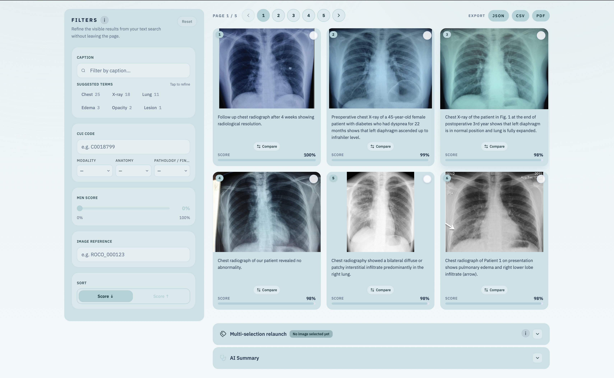
</p>

---

## A Product-Led Retrieval Experience

MediScan AI is a multimodal search product for medical imaging. It allows a user to:

- start from an uploaded image
- start from a clinical text query
- relaunch from one result or several selected results
- compare retrieved cases visually
- generate an AI-assisted synthesis from ranked evidence
- navigate the full workflow inside a polished, bilingual, theme-consistent interface

The goal is simple: make medical retrieval feel like a serious product, with strong UX, strong technical foundations, and a presentation layer that looks ready for GitHub, demo day, or portfolio review.

---

## Product Preview

<table>
  <tr>
    <td align="center" width="33%">
      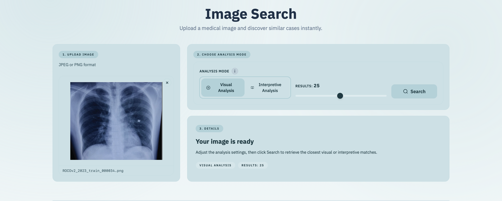<br />
      <strong>Visual Retrieval</strong><br />
      Start from an image and retrieve structurally similar exams.
    </td>
    <td align="center" width="33%">
      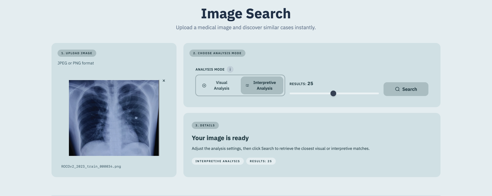<br />
      <strong>Semantic Retrieval</strong><br />
      Retrieve cases through medically aligned meaning, not only visual resemblance.
    </td>
    <td align="center" width="33%">
      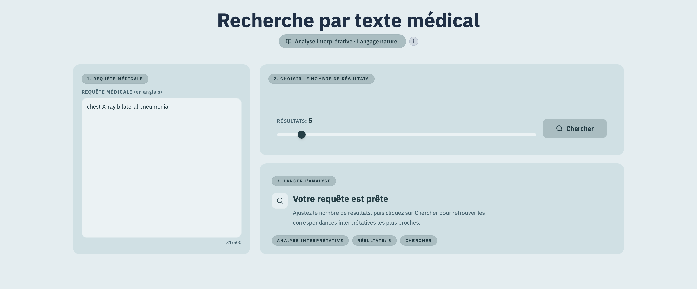<br />
      <strong>Text Search</strong><br />
      Move from clinical wording to relevant image evidence.
    </td>
  </tr>
</table>

---

## Interface Gallery

<table>
  <tr>
    <td align="center" width="50%">
      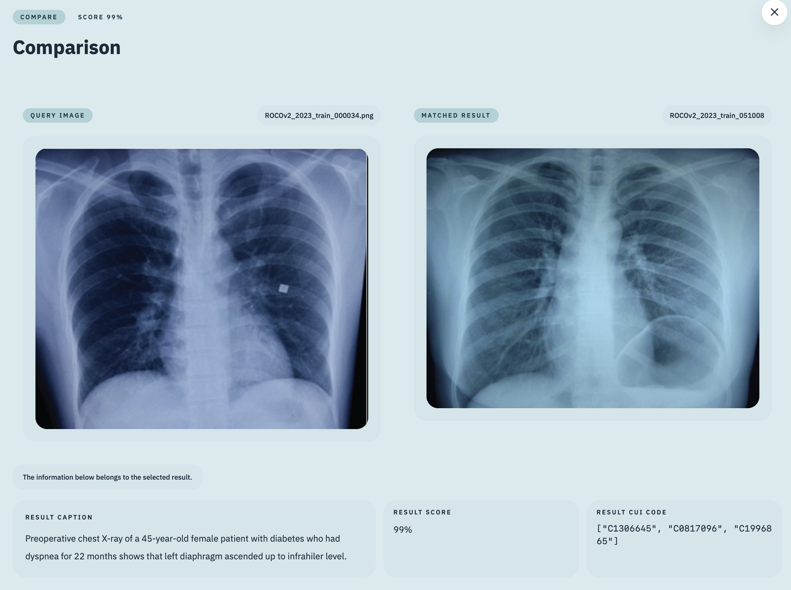<br />
      <strong>Detail and comparison flows</strong><br />
      Retrieved cases can be opened, compared, and relaunch-used inside the same dark product surface.
    </td>
    <td align="center" width="50%">
      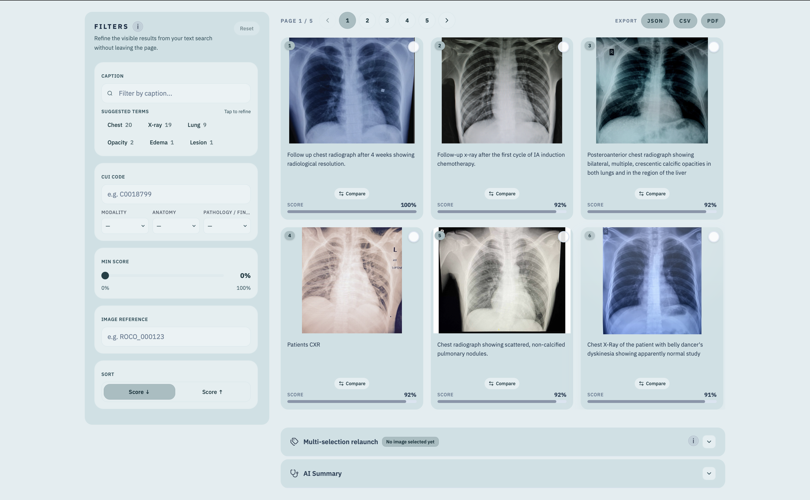<br />
      <strong>Interpretive workspace</strong><br />
      The semantic mode is not just another search box, it is a distinct interpretive workflow.
    </td>
  </tr>
  <tr>
    <td align="center" width="50%">
      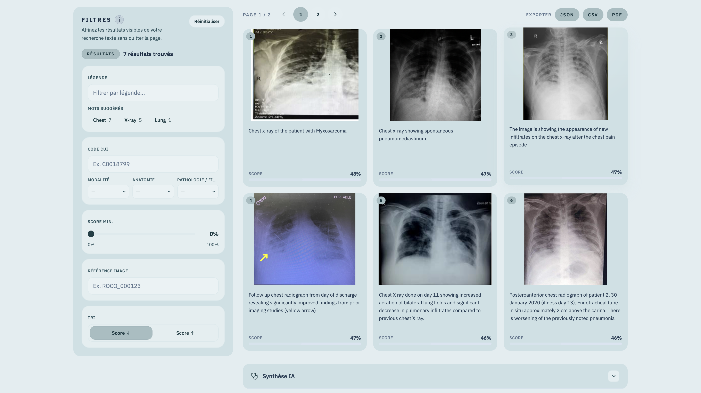<br />
      <strong>Text-first exploration</strong><br />
      A clinical query can directly become a ranked visual evidence trail.
    </td>
    <td align="center" width="50%">
      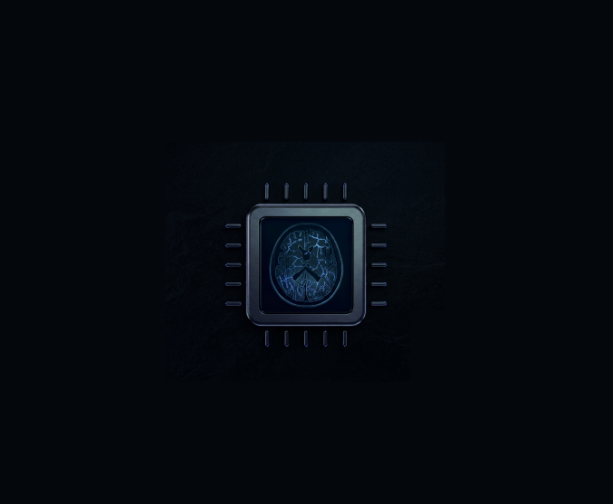<br />
      <strong>Retrieval plus synthesis</strong><br />
      The platform connects search and AI synthesis instead of treating them as separate demos.
    </td>
  </tr>
</table>

---

# Technical Breakdown

The first half of this README shows the product surface.  
The second half explains the retrieval architecture, the engineering choices, and why the system is built the way it is.

---

## Why There Are Two Retrieval Architectures

MediScan AI does not try to force every search workflow through one universal embedding strategy.  
It uses two complementary retrieval architectures because they solve different problems.

### DINOv2: when the image itself is the strongest signal

DINOv2 is used for the **visual retrieval** path.

What it is good at:

- morphology
- texture
- composition
- acquisition style
- visual structure and layout similarity

What that means in practice:

- if the user already has a reference scan or image
- if the goal is to find exams that look visually close
- if structural similarity matters more than language or report semantics

This is the right architecture when the query begins with pixels and the user wants nearest neighbors in visual space.

### BioMedCLIP: when meaning matters more than pure appearance

BioMedCLIP is used for the **semantic retrieval** and **text-to-image retrieval** paths.

What it is good at:

- image-language alignment
- anatomy-aware and medically aligned retrieval
- moving between text and image in the same embedding space
- finding conceptually relevant cases even when pixel similarity is weaker

What that means in practice:

- the user can start from a clinical text query
- an image can be interpreted through a more semantic lens
- retrieval is driven by medical meaning, not just local visual resemblance

This is the right architecture when the query begins with language, or when the user wants medically relevant similarity rather than only pixel-level similarity.

### Why both matter together

Using both DINOv2 and BioMedCLIP gives the product two different retrieval brains:

- one optimized for **what looks similar**
- one optimized for **what means something similar**

That is a strong technical decision because it reflects how real users think: sometimes they search from appearance, sometimes from interpretation, sometimes from text alone.

---

## Architecture Overview

<p align="center">
  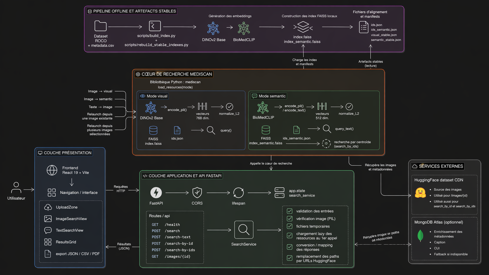
</p>

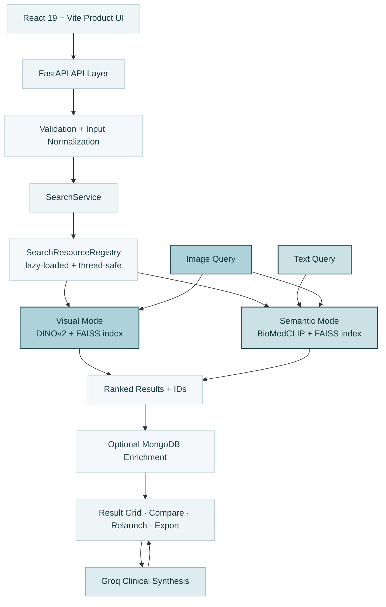

### What this architecture is for

- **React + Vite** handles the product layer and interaction model
- **FastAPI** exposes a clean retrieval-focused API surface
- **SearchService** centralizes runtime logic
- **SearchResourceRegistry** avoids reloading heavy FAISS/model resources on every request
- **DINOv2** powers morphology-first retrieval
- **BioMedCLIP** powers semantic and text-to-image retrieval
- **Groq** adds synthesis on top of retrieval results rather than replacing the retrieval core

The point of this architecture is not just performance. It is separation of concerns: retrieval, orchestration, UI, and AI assistance each have a clear place in the system.

---

## Core Engineering Highlights

### Backend

- FastAPI application with explicit routes for image search, text search, relaunch from IDs, multi-image relaunch, AI conclusion, and contact
- lazy startup design so heavy retrieval resources are loaded on demand
- thread-safe shared registry for embedders and FAISS indexes
- structured validation for upload size, image bytes, content type, text queries, mode normalization, and selected IDs
- optional enrichment pipeline for metadata

### Retrieval

- stable artifact configuration per mode
- separate indexes for visual and semantic search
- text-to-image retrieval path through BioMedCLIP
- image-to-image visual retrieval path through DINOv2
- centroid-based relaunch from multiple selected results

### Frontend

- React 19 interface with polished multi-page product presentation
- distinct visual, interpretive, and text search journeys
- result cards, detail modal, compare modal, summary panel, and exports
- bilingual French/English UX
- light and dark theming across the retrieval experience
- showcase-oriented home page with demo storytelling and screenshots

### Product quality

- one-command project startup via `run.sh` and `run.bat`
- Git LFS handling for large FAISS artifacts
- repository structured to support demo, evaluation, and development workflows

---

## Evaluation and Benchmarking

The repository includes a dedicated evaluation layer documented in [`docs/evaluation.md`](docs/evaluation.md).

### Benchmark base

| Item | Value |
|---|---|
| Dataset | ROCOv2 |
| Indexed images | 59,962 |
| Standard benchmark queries | 1,999 |
| Strict annotated subset | 12,251 images |
| Main target metric | `TMO_resultats` |

### Selected results

| Mode | Standard `TMO_resultats` | Strict `TMO_resultats` | Standard `Precision@K (CUI)` |
|---|---:|---:|---:|
| Visual | 40.7% | 86.3% | 92.3% |
| Semantic | 45.7% | 90.4% | 93.9% |

### Why these results matter

- the semantic pipeline wins on the main retrieval relevance metric
- the project includes measurable evidence, not only qualitative screenshots
- evaluation is reproducible and already structured for future tuning work

For full details, see [`docs/evaluation.md`](docs/evaluation.md) and the proof files in [`proofs/`](proofs).

---

## API Surface

| Endpoint | Purpose |
|---|---|
| `GET /api/health` | API health check |
| `POST /api/search` | image upload retrieval |
| `POST /api/search-text` | text-to-image retrieval |
| `POST /api/search-by-id` | relaunch from one indexed image |
| `POST /api/search-by-ids` | relaunch from multiple selected images |
| `POST /api/generate-conclusion` | AI synthesis generation |
| `POST /api/contact` | contact form delivery |
| `GET /api/images/{image_id}` | redirect to public image asset |

---

## Quick Start

### Prerequisites

- Python `3.11`
- Node.js `>= 20.19.0` or `>= 22.12.0`
- npm
- Git LFS

### Clone and fetch artifacts

```bash
git clone https://github.com/OzanTaskin/mediscan-cbir.git
cd mediscan-cbir
git lfs install
git lfs pull
```

### Configure environment

```bash
cp .env.example .env
```

If you want AI synthesis enabled:

```env
GROQ_KEY_API=your_groq_api_key_here
```

### Run the full project

#### macOS / Linux

```bash
chmod +x run.sh
./run.sh
```

#### Windows

```bat
run.bat
```

### Open the app

- Frontend: `http://127.0.0.1:5173`
- Backend: `http://127.0.0.1:8000`
- Health check: `http://127.0.0.1:8000/api/health`

---

## Developer Commands

### Frontend

```bash
cd frontend
npm ci
npm run dev
npm run lint
npm run build
```

### Backend

```bash
python3.11 -m venv .venv311
source .venv311/bin/activate
pip install -r requirements.txt
PYTHONPATH=src uvicorn backend.app.main:app --host 127.0.0.1 --port 8000
```

### Tests

```bash
pytest
```

---

## Repository Structure

```text
.
├── backend/           FastAPI app, API routes, services, validation
├── frontend/          React product interface and demo assets
├── src/mediscan/      retrieval runtime, embedders, indexing logic
├── artifacts/         FAISS indexes, ids, manifests
├── scripts/           evaluation and benchmark scripts
├── tests/             Python test suite
├── proofs/            result evidence and benchmark outputs
├── docs/              evaluation and supporting documentation
├── run.sh             one-command startup for macOS / Linux
├── run.bat            one-command startup for Windows
└── README.md          GitHub-facing product overview
```

---

## The 3 Retrieval Modes

### 1. Visual Mode

<p align="center">
  
</p>

**What it is**

Visual mode searches by appearance. It is the right choice when the user already has a medical image and wants cases that are visually close in morphology, structure, composition, or acquisition pattern.

**What it is useful for**

- look-alike case retrieval
- structural comparison
- quick nearest-neighbor exploration from a scan
- similarity driven by the image itself

### 2. Semantic Mode

<p align="center">
  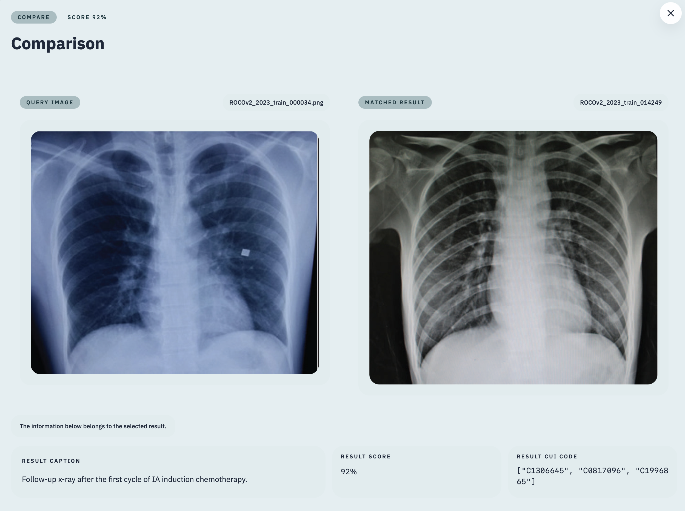
</p>

**What it is**

Semantic mode searches through a medically aligned embedding space. It is less about raw visual closeness and more about finding conceptually relevant cases through anatomy, pathology, and shared clinical meaning.

**What it is useful for**

- medically relevant neighbor retrieval
- interpretation-oriented exploration
- retrieval when meaning matters more than pure pixel similarity
- bridging image understanding with language-aware similarity

### 3. Text Search Mode

<p align="center">
  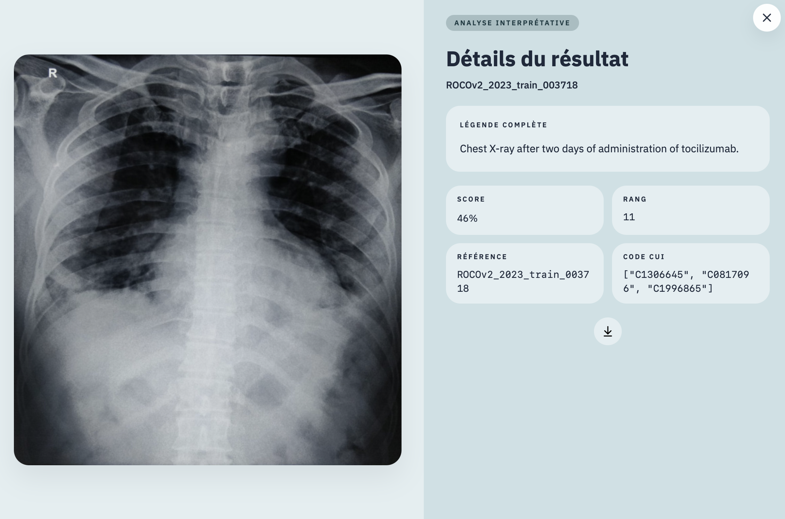
</p>

**What it is**

Text search mode starts from clinical language instead of an image. The user can describe a case, an anatomy, or a pathological context and retrieve related images directly from the semantic index.

**What it is useful for**

- retrieval without a reference image
- exploration from radiology-like wording
- moving from report language to image evidence
- text-first medical discovery workflows

---

## Why This Repo Works Well on GitHub

This repository is a strong GitHub showcase because it proves several things at once:

- you can build a real AI product end-to-end
- you understand when to use different retrieval architectures
- you can turn backend complexity into a polished user-facing experience
- you can present technical work with product clarity and visual quality

For a recruiter, reviewer, collaborator, or professor, this reads as a serious AI product engineering project rather than a minimal academic proof of concept.

---

## Disclaimer

MediScan AI is a **non-clinical academic prototype**.

It is intended for experimentation, retrieval research, interface design, and AI product engineering demonstration. It must not be used as a medical device or as a substitute for clinical judgment.
