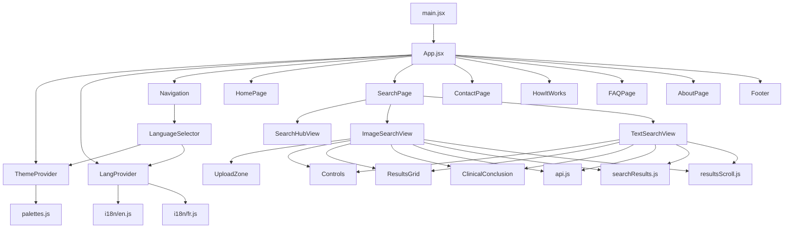

# Frontend Review

Date initiale: 2026-04-21  
Mise à jour: 2026-04-22  
Périmètre: `frontend/` uniquement  
Statut courant: phase 1 largement exécutée; `npm run lint` et `npm run build` OK dans `frontend/`  
Objectif: cartographier précisément le frontend actuel pour préparer un nettoyage de code mort, une factorisation prudente et une amélioration nette de la lisibilité sans régression fonctionnelle.

## 1. Méthode de revue

Cette revue repose sur:

- l’inventaire complet des fichiers présents dans `frontend/`
- une lecture ciblée de tous les fichiers source du runtime frontend
- une exécution de `npm run lint`
- un scan des dépendances structurelles entre modules
- un scan des assets publics référencés, manquants ou non utilisés

Le frontend contient aujourd’hui:

- `32 122` lignes dans `frontend/src`
- `10 422` lignes dans `frontend/src/index.css`
- plusieurs composants très volumineux qui concentrent une grande partie du risque

## 2. Résumé exécutif

Le frontend est globalement fonctionnel, mais il présente une accumulation visible de couches historiques, de responsabilités mélangées et de branches orphelines.

Les constats initiaux principaux étaient:

1. Le code est piloté par quelques très gros fichiers:
   - `src/index.css` (`10 422` lignes)
   - `src/components/ResultsGrid.jsx` (`1 308` lignes)
   - `src/components/ImageSearchView.jsx` (`1 307` lignes)
   - `src/components/HomePage.jsx` (`915` lignes)
   - `src/components/TextSearchView.jsx` (`884` lignes)
2. Il existe du code confirmé comme inutile ou dormant:
   - fichiers de backup dans `src/`
   - anciens contextes (`lang-context.js`, `theme-context.js`) et ancien `useTheme.js` depuis recréé comme hook actif
   - route `features` traitée dans la logique d’`App.jsx` mais pas réellement branchée comme page active
   - logique “tree / anchor nav” résiduelle dans `HomePage.jsx`
   - props et états non utilisés dans plusieurs composants
3. Une grande partie du comportement métier est entassée dans peu de composants “god components”, surtout:
   - `ImageSearchView.jsx`
   - `TextSearchView.jsx`
   - `ResultsGrid.jsx`
   - `Controls.jsx`
4. La couche i18n n’est pas qu’une couche de labels: elle contient de vraies structures de contenu qui influencent l’UI.
5. La dette CSS est élevée: `index.css` sert de dépôt central quasi unique pour le styling.
6. Le lint confirmait un état intermédiaire de refactor inachevé: `33` problèmes (`21` erreurs, `12` warnings).

Conclusion pratique: il faut traiter ce frontend comme un système déjà en production, avec nettoyage progressif par strates et vérification après chaque étape, pas comme un simple “grand coup de ménage”.

## 2 bis. Mise à jour d'avancement (2026-04-22)

Depuis la revue initiale, un premier lot de nettoyage prudent a été appliqué et revalidé.

Travail effectivement réalisé:

- suppression des fichiers morts confirmés:
  - `src/index.css.before-restore`
  - `src/components/HomePage.jsx.backup-before-restore`
  - `src/context/lang-context.js`
  - `src/context/theme-context.js`
- nettoyage de bruit confirmé dans les composants:
  - retrait de la couche historique `tree / anchor nav` dans `HomePage.jsx`
  - suppression des structures locales non rendues dans `AboutPage.jsx`
  - retrait des inutilisés évidents dans `Navigation.jsx`
  - nettoyage des inutilisés les moins risqués dans `ImageSearchView.jsx`
- clarification de la couche contextes:
  - séparation des objets de contexte actifs dans `LangContextValue.js` et `ThemeContextValue.js`
  - `useTheme.js` est désormais un hook actif branché sur le contexte réel, et non plus un reliquat
- nettoyage des warnings React / ESLint les plus sûrs dans les vues de recherche et composants transverses, sans changement intentionnel du design

Validations relancées après nettoyage:

- `npm run lint` dans `frontend/`: `0` problème
- `npm run build` dans `frontend/`: OK

Note de validation importante:

- une panne de recherche détectée pendant la passe de nettoyage ne provenait pas du frontend, mais d’un blocage du backend au démarrage
- le diagnostic a confirmé que le frontend appelait toujours correctement les endpoints
- ce point ne doit donc pas être reclassé comme dette frontend, même s’il a dû être corrigé pour restaurer les parcours de recherche

## 3. Cartographie d’architecture



### Lecture rapide de l’architecture

- `main.jsx` monte l’application.
- `App.jsx` joue le rôle de shell applicatif, de routeur maison et d’orchestrateur d’ambiance visuelle.
- `ThemeContext.jsx` et `LangContext.jsx` portent les deux contextes globaux réellement actifs.
- Le pôle `SearchPage -> SearchHubView / ImageSearchView / TextSearchView` concentre le métier principal.
- `ResultsGrid.jsx` concentre à la fois rendu de liste, sélection, pagination, export et modales.
- `index.css` concentre une quantité massive de styles transverses.

## 4. Zones critiques anti-régression

Avant toute suppression, il faut considérer ces zones comme sensibles:

- Le routeur maison dans `App.jsx`
  - Il gère route, ton visuel, lock de scroll, transitions et préchargement.
- Les contextes thème/langue
  - Ils pilotent l’UI globale, le `localStorage`, la transition visuelle et le chargement des messages.
- Les vues de recherche
  - Elles embarquent le cœur du produit: upload, requêtes, filtrage, résultats, scroll guidé, export, conclusion.
- `ResultsGrid.jsx`
  - Il mélange beaucoup de comportements utilisateur à forte sensibilité.
- La couche i18n
  - Supprimer des données “qui ont l’air mortes” peut casser une vue si le composant les consomme indirectement.
- `index.css`
  - Un nettoyage non segmenté peut casser des zones éloignées du composant que l’on modifie.
- Le contrat `public/` <-> i18n <-> composants
  - Plusieurs assets mentionnés ne sont plus cohérents avec le contenu réellement présent.

## 5. État du lint

Commande exécutée:

```bash
cd frontend
npm run lint
```

Résultat initial au moment de la revue du 2026-04-21:

- `33` problèmes
- `21` erreurs
- `12` warnings

Résultat courant après la première passe de nettoyage et revalidation du 2026-04-22:

- `0` problème
- `npm run build`: OK

Les points détaillés ci-dessous correspondent donc à l’état initial observé lors de la revue. Ils servent désormais surtout d’historique des zones traitées pendant la phase 1.

### Détail des problèmes signalés

#### `src/components/AboutPage.jsx`

- `144:9` `pipeline` inutilisé
- `145:9` `archCards` inutilisé
- `146:9` `stackItems` inutilisé

Lecture: le composant conserve des structures de contenu non rendues dans l’UI actuelle.

#### `src/components/Controls.jsx`

- `122:7` `setPendingMode(null)` dans un `useEffect`
- `128:5` `setPendingMode(null)` dans un `useEffect`
- `156:7` `setPopoverStyle(null)` dans un `useLayoutEffect`

Lecture: le composant se repose sur des effets pour synchroniser de l’état dérivé, ce qui indique une API devenue trop compliquée.

#### `src/components/FeatureCarousel.jsx`

- `26:5` `setIndex(0)` dans un `useEffect`
- `292:7` `setSharedSlideIndex(0)` dans un `useEffect`

Lecture: le carrousel s’est enrichi au point de nécessiter des resets synchrones d’état au lieu d’une modélisation plus claire.

#### `src/components/HomePage.jsx`

- `218:10` `isTreePanelVisible` inutilisé
- `219:10` `isAnchorNavPinned` inutilisé
- `233:10` `treeWires` inutilisé
- `261:9` `scrollTreeToViewportCenter` inutilisé
- `286:9` `scrollToSection` inutilisé

Lecture: présence confirmée d’une couche historique “tree / anchor nav” partiellement abandonnée.

#### `src/components/ImageSearchView.jsx`

- `54:71` prop `useSharedSurface` inutilisée
- `80:23` `setCompareMode` inutilisé
- `354:9` `canExport` inutilisé
- warnings sur cleanup de refs et dépendances manquantes autour du filtrage et du scroll

Lecture: le composant concentre trop de responsabilités et contient des embranchements plus maintenus complètement.

#### `src/components/Navigation.jsx`

- `37:3` `isScrolled` inutilisé

Lecture: dédoublement entre props montantes et logique locale.

#### `src/components/ResultsGrid.jsx`

- warnings sur dépendances de `useEffect`
- warning sur `resultRows` à mémoriser

Lecture: forte densité de logique dérivée dans un composant déjà trop grand.

#### `src/components/SearchHubView.jsx`

- `135:7` `setHubIntroState("done")` dans un `useEffect`

Lecture: animation d’intro pilotée avec de l’état synchrone qui pourrait être dérivé autrement.

#### `src/components/TextSearchView.jsx`

- warnings sur cleanup de refs
- warning sur dépendance manquante `runSearchAutoScrollAttempt`

Lecture: mêmes symptômes que `ImageSearchView`, mais sur une version plus simple.

#### `src/context/LangContext.jsx`

- export de contexte dans le même fichier que le provider

Lecture: structure non idéale pour Fast Refresh et signe d’un fichier trop chargé.

#### `src/context/ThemeContext.jsx`

- export de contexte, constantes et hook dans le même fichier que le provider

Lecture: même problème, avec une logique thème/palette encore plus dense.

## 6. Cartographie détaillée par fichier

### 6.1 Racine `frontend/`

| Fichier | Lignes | Rôle | Couplages / observations | Risque / action recommandée |
| --- | ---: | --- | --- | --- |
| `frontend/package.json` | n/a | manifeste NPM | scripts `dev`, `build`, `lint`, `preview`; dépendances React/Vite/jspdf/lucide | stable; vérifier seulement les dépendances réellement utilisées après nettoyage |
| `frontend/package-lock.json` | n/a | lockfile généré | reflète l’état des dépendances | ne pas éditer manuellement; régénérer seulement si dépendances changent |
| `frontend/vite.config.js` | n/a | config bundler | proxy `/api`, `manualChunks`, port `3000` | important pour le comportement de dev et le découpage bundle |
| `frontend/eslint.config.js` | n/a | règles lint | signale actuellement une partie du code mort et des patterns React à risque | à garder comme base de fiabilisation |
| `frontend/index.html` | n/a | shell HTML | fixe police, `lang`, point d’entrée Vite, `preconnect` backend local | attention au script `lang` limité à `fr/en` |
| `frontend/.env.example` | n/a | contrat d’environnement | `VITE_API_BASE`, `VITE_BACKEND_ORIGIN` | stable; utile pour documenter l’API |
| `frontend/.gitignore` | n/a | ignore git | standard Vite | pas un sujet de nettoyage frontend |
| `frontend/PALETTE_GUIDE.md` | n/a | doc palette | documente système de palette et query param `?palette=` | utile, mais à réaligner si la couche thème évolue |

### 6.2 Entrée d’application et styles

| Fichier | Lignes | Rôle | Couplages / observations | Risque / action recommandée |
| --- | ---: | --- | --- | --- |
| `frontend/src/main.jsx` | 5 | bootstrap React minimal | monte `App.jsx` et charge `index.css` | sain et lisible |
| `frontend/src/App.jsx` | 336 | shell principal, routeur maison, orchestration visuelle | dépend de `LangProvider`, `ThemeProvider`, `Navigation`, `HomePage`, `Footer`, lazy pages, `useDesktopNavVisibility` | fichier stratégique; simplifier par extraction de la table de routes et suppression des branches orphelines |
| `frontend/src/index.css` | 10 422 | feuille de styles principale | concentre la quasi-totalité du design system et des styles de pages/composants | principal goulot d’étranglement de lisibilité; découpage impératif à moyen terme |
| `frontend/src/theme/README.md` | 37 | doc locale thème | indique que le thème est fusionné dans `index.css`; contient un historique de structure | utile comme contexte, mais pas comme source de vérité |
| `frontend/src/theme/palettes.js` | 208 | registre de palettes et utilitaires CSS vars | utilisé par `ThemeContext.jsx`; contient `classic`, `mineral`, `slate`, `custom-test`, `clinical-tech` | vivant; bon candidat à conserver comme module isolé |

Note de mise à jour:

- `frontend/src/index.css.before-restore` a été supprimé le 2026-04-22 après vérification d’absence d’usage runtime

### 6.3 API, hooks, data, utils

| Fichier | Lignes | Rôle | Couplages / observations | Risque / action recommandée |
| --- | ---: | --- | --- | --- |
| `frontend/src/api.js` | 109 | couche d’accès API | centralise `searchImage`, `searchText`, `searchById`, `searchByIds`, `fetchConclusion`, `sendContactMessage` | plutôt sain; préserver comme façade unique |
| `frontend/src/hooks/useDesktopNavVisibility.js` | 74 | visibilité navbar desktop selon scroll | utilisé par `App.jsx` | aujourd’hui redondant avec une partie de `Navigation.jsx`; choisir une seule source de vérité |
| `frontend/src/data/cuiCategories.js` | 29 | taxonomie CUI statique | utilisé par les vues de recherche | petit module clair, à garder |
| `frontend/src/utils/resultsScroll.js` | 59 | helpers de scroll vers résultats | utilisé par `ImageSearchView.jsx` et `TextSearchView.jsx` | cohérent; bon module utilitaire |
| `frontend/src/utils/searchResults.js` | 295 | filtrage résultats + suggestions + export JSON/CSV/PDF | utilisé par les deux vues de recherche | module important; possible extraction supplémentaire par responsabilité (`filters`, `exports`) |

### 6.4 Contextes

| Fichier | Lignes | Rôle | Couplages / observations | Risque / action recommandée |
| --- | ---: | --- | --- | --- |
| `frontend/src/context/LangContext.jsx` | 77 | provider langue actif | s’appuie désormais sur `LangContextValue.js`; ne charge que `en` et `fr`; gère `localStorage`, transitions, messages | vivant mais plus lisible qu’au moment de la revue initiale |
| `frontend/src/context/LangContextValue.js` | 3 | objet de contexte langue actif | séparé du provider pour Fast Refresh et clarté | sain; à conserver |
| `frontend/src/context/ThemeContext.jsx` | 118 | provider thème/palette actif | s’appuie désormais sur `ThemeContextValue.js`; gère thème, palette, `prefers-color-scheme`, transitions, URL palette | vivant mais encore dense |
| `frontend/src/context/ThemeContextValue.js` | 3 | objet de contexte thème actif | séparé du provider pour Fast Refresh et clarté | sain; à conserver |
| `frontend/src/context/useTheme.js` | 8 | hook thème actif | branché sur `ThemeContextValue.js`; remplace l’ancien reliquat | vivant; à garder |

Note de mise à jour:

- `frontend/src/context/lang-context.js` et `frontend/src/context/theme-context.js` ont été supprimés le 2026-04-22 après vérification d’absence d’import runtime

### 6.5 Composants pages et layout

| Fichier | Lignes | Rôle | Couplages / observations | Risque / action recommandée |
| --- | ---: | --- | --- | --- |
| `frontend/src/components/Navigation.jsx` | 244 | navbar desktop/mobile, menu overlay | dépend de `LanguageSelector`; mélange état local menu mobile et logique de scroll | réduire la duplication avec `useDesktopNavVisibility.js` |
| `frontend/src/components/Footer.jsx` | 145 | footer multi-liens | dépend des traductions et de `onPageChange` | plutôt sain |
| `frontend/src/components/LanguageSelector.jsx` | 136 | sélecteurs langue + thème | ne propose que `en` et `fr`; dépend des deux contextes | vivant; cohérent avec le runtime réel |
| `frontend/src/components/HomePage.jsx` | 915 | landing principale | dépend de `LangContext`, icônes, `FeaturesShowcase`, `DemosShowcase`; contient une grosse couche morte “tree / anchors” | très fort candidat à nettoyage par suppression sécurisée de la couche historique |
| `frontend/src/components/SearchPage.jsx` | 90 | conteneur de vues de recherche | choisit entre `SearchHubView`, `ImageSearchView`, `TextSearchView` | sain, mais prop `useSharedSurface` n’est pas cohérente dans toutes les vues |
| `frontend/src/components/SearchHubView.jsx` | 235 | écran d’entrée recherche image/texte | dépend de `LangContext` et des icônes; intro animée, observer, choix de parcours | vivant; petit refactor possible sur l’intro animée |
| `frontend/src/components/ImageSearchView.jsx` | 1 307 | vue de recherche image | upload, requêtes API, filtres, scroll, sélection, relance, export, conclusion, guides | composant critique et surchargé; à découper en hooks + sections UI |
| `frontend/src/components/TextSearchView.jsx` | 884 | vue de recherche texte | logique similaire à ImageSearchView sans upload | duplication forte avec ImageSearchView; excellent candidat à factorisation |
| `frontend/src/components/ContactPage.jsx` | 281 | formulaire de contact | soumission API, état succès, animation d’entrée | plutôt autonome et lisible |
| `frontend/src/components/HowItWorks.jsx` | 88 | page statique “How it works” | consomme `t.howItWorks` | simple, mais ne rend pas forcément toute la structure disponible côté i18n |
| `frontend/src/components/FAQPage.jsx` | 133 | FAQ par catégories et accordéon | dépend du contenu traduit et de `Spinner` | composant raisonnablement clair |
| `frontend/src/components/AboutPage.jsx` | 254 | page “about” | utilise `useTheme` pour les visuels mission/vision; conserve du contenu non rendu | bon candidat à simplification par suppression de variables et de données dormantes |
| `frontend/src/components/FeaturesPage.jsx` | 96 | page de features autonome | utilise `t.features` et un set d’icônes local | paraît peu ou pas branché dans le flux réel; vérifier avant suppression ou réintégration |

### 6.6 Composants partagés métier / UI

| Fichier | Lignes | Rôle | Couplages / observations | Risque / action recommandée |
| --- | ---: | --- | --- | --- |
| `frontend/src/components/Controls.jsx` | 376 | bloc de contrôle recherche | gère mode, slider `k`, CTA, popover de confirmation, portal | API très large, logique d’état complexe; bon candidat à découpage |
| `frontend/src/components/ResultsGrid.jsx` | 1 308 | résultats, cartes, pagination, sélection, modales, export | dépend de l’API image URL, du contexte langue, de `react-dom` | composant trop dense; séparer modales, carte, toolbar, pagination |
| `frontend/src/components/ClinicalConclusion.jsx` | 224 | synthèse IA des résultats | dépend de `fetchConclusion` et du top résultats | fonctionnel mais couplé au format des résultats |
| `frontend/src/components/UploadZone.jsx` | 217 | upload drag/drop/paste avec preview | gestion propre des URLs d’objet et du DnD | vivant et relativement autonome |
| `frontend/src/components/StatusBar.jsx` | 63 | retour d’état simple | faible couplage | sain |
| `frontend/src/components/Spinner.jsx` | 38 | spinner simple | faible couplage | sain |
| `frontend/src/components/icons.jsx` | 46 | icônes de modes | utilisé par `HomePage`, `SearchHubView`, `ImageSearchView` | module simple |

### 6.7 Carrousels et vitrines

| Fichier | Lignes | Rôle | Couplages / observations | Risque / action recommandée |
| --- | ---: | --- | --- | --- |
| `frontend/src/components/FeatureCarousel.jsx` | 548 | carrousel multi-cartes et diaporama | utilisé par `FeaturesShowcase` et `DemosShowcase`; gère drag, wheel, clavier, slideshow | composant assez dense; à réduire et documenter |
| `frontend/src/components/FeaturesShowcase.jsx` | 53 | wrapper vitrine des features | très fin; consomme `t.features.showcaseCards` | sain |
| `frontend/src/components/DemosShowcase.jsx` | 78 | wrapper démos visuelles | dépend du thème et d’assets `Day_*` / `Dark_*` | sain, mais contrat asset à surveiller |

Note de mise à jour:

- `frontend/src/components/HomePage.jsx.backup-before-restore` a été supprimé le 2026-04-22 après vérification d’absence d’usage runtime

### 6.8 Internationalisation

| Fichier | Lignes | Rôle | Couplages / observations | Risque / action recommandée |
| --- | ---: | --- | --- | --- |
| `frontend/src/i18n/en.js` | 906 | contenu anglais complet | contient `nav`, `home`, `search`, `about`, `contact`, `howItWorks`, `faq`, `features`, `demos` | vivant; sert de référence structurelle réelle |
| `frontend/src/i18n/fr.js` | 902 | contenu français complet | même couverture que `en.js` | vivant; sert aussi de référence |
| `frontend/src/i18n/ar.js` | 731 | contenu arabe partiel | pas de `features` ni `demos`; contient des refs asset obsolètes | dormant dans le runtime actuel |
| `frontend/src/i18n/de.js` | 718 | contenu allemand partiel | pas de `features` ni `demos`; refs asset obsolètes | dormant dans le runtime actuel |
| `frontend/src/i18n/es.js` | 726 | contenu espagnol partiel | pas de `features` ni `demos`; refs asset obsolètes | dormant dans le runtime actuel |
| `frontend/src/i18n/it.js` | 718 | contenu italien partiel | pas de `features` ni `demos`; refs asset obsolètes | dormant dans le runtime actuel |
| `frontend/src/i18n/ja.js` | 731 | contenu japonais partiel | pas de `features` ni `demos`; refs asset obsolètes | dormant dans le runtime actuel |
| `frontend/src/i18n/ko.js` | 731 | contenu coréen partiel | pas de `features` ni `demos`; refs asset obsolètes | dormant dans le runtime actuel |
| `frontend/src/i18n/pt.js` | 718 | contenu portugais partiel | pas de `features` ni `demos`; refs asset obsolètes | dormant dans le runtime actuel |
| `frontend/src/i18n/tr.js` | 718 | contenu turc partiel | pas de `features` ni `demos`; refs asset obsolètes | dormant dans le runtime actuel |
| `frontend/src/i18n/zh.js` | 737 | contenu chinois partiel | pas de `features` ni `demos`; refs asset obsolètes | dormant dans le runtime actuel |

### 6.9 Assets publics

| Fichier | Rôle / usage probable | Observation |
| --- | --- | --- |
| `frontend/public/Day_visual_1.png` | démo visuelle light | utilisé par `DemosShowcase.jsx` |
| `frontend/public/Day_visual_2.png` | démo visuelle light | utilisé |
| `frontend/public/Day_visual_3.png` | démo visuelle light | utilisé |
| `frontend/public/Dark_visual_1.png` | démo visuelle dark | utilisé |
| `frontend/public/Dark_visual_2.png` | démo visuelle dark | utilisé |
| `frontend/public/Dark_visual_3.png` | démo visuelle dark | utilisé |
| `frontend/public/Day_interp_1.png` | démo interprétative light | utilisé |
| `frontend/public/Day_interp_2.png` | démo interprétative light | utilisé |
| `frontend/public/Day_interp_3.png` | démo interprétative light | utilisé |
| `frontend/public/Dark_Interp_1.png` | démo interprétative dark | utilisé |
| `frontend/public/Dark_interp_2.png` | démo interprétative dark | utilisé |
| `frontend/public/Dark_interp_3.png` | démo interprétative dark | utilisé |
| `frontend/public/HomeSpine.png` | visuel home | utilisé par `HomePage.jsx` |
| `frontend/public/mission.png` | visuel about light | utilisé par `AboutPage.jsx` |
| `frontend/public/mission_d.png` | visuel about dark | utilisé par `AboutPage.jsx` |
| `frontend/public/goal.png` | visuel about light | utilisé par `AboutPage.jsx` |
| `frontend/public/goal_d.png` | visuel about dark | utilisé par `AboutPage.jsx` |
| `frontend/public/llm.png` | probablement ancien visuel about/features | référencé par contenu i18n ou couche historique |
| `frontend/public/llm_d.png` | idem | référencé indirectement / historique |
| `frontend/public/export_d.png` | ancien visuel | référencé seulement dans du contenu partiellement obsolète |
| `frontend/public/Logo-2.svg` | logo | présent |
| `frontend/public/photo-ozan.jpeg` | photo équipe | utilisé par `AboutPage.jsx` |
| `frontend/public/photo-ales.jpeg` | photo équipe | utilisé |
| `frontend/public/photo-maxime.jpeg` | photo équipe | utilisé |
| `frontend/public/photo-rayane.jpeg` | photo équipe | utilisé |
| `frontend/public/Dark_text_1.png` | asset non référencé | candidat à audit puis suppression |
| `frontend/public/Faiss.png` | asset non référencé | candidat à audit puis suppression |
| `frontend/public/ParisCite.png` | asset non référencé | candidat à audit puis suppression |
| `frontend/public/Python.png` | asset non référencé | candidat à audit puis suppression |
| `frontend/public/Pytorch.png` | asset non référencé | candidat à audit puis suppression |
| `frontend/public/vec.png` | asset non référencé | candidat à audit puis suppression |

## 7. Dépendances notables entre modules

### Couche shell

- `App.jsx` dépend directement de:
  - `./context/LangContext`
  - `./context/ThemeContext`
  - `./components/Navigation`
  - `./components/HomePage`
  - `./components/Footer`
  - `./components/Spinner`
  - `./hooks/useDesktopNavVisibility`

### Couche recherche

- `ImageSearchView.jsx` dépend de:
  - `UploadZone`
  - `Controls`
  - `StatusBar`
  - `ResultsGrid`
  - `ClinicalConclusion`
  - `api.js`
  - `searchResults.js`
  - `resultsScroll.js`
  - `cuiCategories.js`

- `TextSearchView.jsx` dépend de:
  - `Controls`
  - `StatusBar`
  - `ResultsGrid`
  - `ClinicalConclusion`
  - `api.js`
  - `searchResults.js`
  - `resultsScroll.js`
  - `cuiCategories.js`

Observation importante: la duplication structurelle entre `ImageSearchView.jsx` et `TextSearchView.jsx` est forte. Le différentiel métier réel est plus faible que la duplication de code présente.

### Couche contenu et vitrine

- `HomePage.jsx` dépend de:
  - `LangContext`
  - `icons.jsx`
  - `FeaturesShowcase.jsx`
  - `DemosShowcase.jsx`

- `DemosShowcase.jsx` dépend de:
  - `LangContext`
  - `ThemeContext`
  - `FeatureCarousel.jsx`

- `FeaturesShowcase.jsx` dépend de:
  - `LangContext`
  - `FeatureCarousel.jsx`

## 8. Couches mortes, dormantes ou suspectes

### 8.1 Couches confirmées mortes ou quasi certaines

Fichiers confirmés morts et déjà supprimés:

- `frontend/src/components/HomePage.jsx.backup-before-restore`
- `frontend/src/index.css.before-restore`
- `frontend/src/context/lang-context.js`
- `frontend/src/context/theme-context.js`

Ces fichiers ne participaient pas au runtime actuel et ont été retirés sans impact fonctionnel observé.

Mise à jour importante:

- `frontend/src/context/useTheme.js` ne fait plus partie de cette catégorie
- le fichier a été recréé comme hook actif branché sur le contexte réel

### 8.2 Code dormant dans des fichiers vivants

#### `frontend/src/components/HomePage.jsx`

Couche historique encore présente:

- `isTreePanelVisible`
- `isAnchorNavPinned`
- `treeWires`
- `scrollTreeToViewportCenter`
- `scrollToSection`
- refs liées à la navigation ancrée et au schéma d’arborescence

Lecture: l’ancien design de home semble avoir conservé une infrastructure de navigation/visualisation qui n’est plus rendue dans le JSX final.

#### `frontend/src/components/AboutPage.jsx`

Contenu défini mais non rendu:

- `pipeline`
- `archCards`
- `stackItems`

Lecture: la page a probablement été réduite visuellement sans nettoyage du modèle de données local.

#### `frontend/src/components/ImageSearchView.jsx`

Éléments suspects ou inachevés:

- prop `useSharedSurface` non utilisée
- setter `setCompareMode` non utilisé
- variable `canExport` non utilisée

Lecture: la logique compare/export/surface a probablement connu plusieurs itérations.

#### `frontend/src/components/Navigation.jsx`

- prop `isScrolled` non utilisée

Lecture: redondance entre calcul externe et calcul interne.

### 8.3 Couches orphelines de structure

#### `frontend/src/components/FeaturesPage.jsx`

Le composant existe, mais l’application actuelle met surtout en avant:

- `FeaturesShowcase.jsx`
- `DemosShowcase.jsx`
- du contenu `features` dans la home

En parallèle, `App.jsx` contient encore une branche de surface pour `route.page === "features"` alors que la table principale des pages ne l’expose pas comme une page première clairement active.

Action: décider explicitement entre:

- réintégrer une vraie page `features`
- ou supprimer la logique de page/features orpheline

### 8.4 Couche i18n partiellement dormante

`LangContext.jsx` ne charge que:

- `en`
- `fr`

En revanche, le repo contient aussi:

- `ar`, `de`, `es`, `it`, `ja`, `ko`, `pt`, `tr`, `zh`

Ces fichiers sont donc présents mais non actifs dans le runtime actuel.

Ils contiennent en plus:

- une couverture de clés incomplète par rapport à `en/fr`
- des références assets obsolètes

Cela signifie que ces fichiers ne doivent pas être supprimés à la légère si l’intention produit est de réouvrir le multilingue plus tard, mais ils ne peuvent pas être considérés comme une couche “vivante” de l’application actuelle.

## 9. Incohérences assets / contenu

### 9.1 Assets publics non référencés dans le runtime frontend

Scan effectué sur `src/` et `index.html`. Assets non référencés détectés:

- `Dark_text_1.png`
- `Faiss.png`
- `ParisCite.png`
- `Python.png`
- `Pytorch.png`
- `vec.png`

Ces fichiers sont de bons candidats à audit:

- soit ils sont réellement morts
- soit ils correspondent à une ancienne version de la page about/features

### 9.2 Références assets cassées dans le contenu source

Références détectées dans les sources vers des fichiers absents de `public/`:

- `Sem_Dark1.png` dans `i18n/en.js`, `i18n/fr.js`
- `Sem_Dark2.png` dans `i18n/en.js`, `i18n/fr.js`
- `Visual_Dark1.png` dans `i18n/en.js`, `i18n/fr.js`
- `Visual_Dark2.png` dans `i18n/en.js`, `i18n/fr.js`
- `export.png` dans `i18n/ar.js`, `i18n/de.js`, `i18n/es.js`, `i18n/it.js`, `i18n/ja.js`, `i18n/ko.js`, `i18n/pt.js`, `i18n/tr.js`, `i18n/zh.js`
- `faiss_about.png` dans `i18n/ar.js`, `i18n/de.js`, `i18n/es.js`, `i18n/it.js`, `i18n/ja.js`, `i18n/ko.js`, `i18n/pt.js`, `i18n/tr.js`, `i18n/zh.js`
- `faiss_about_d.png` dans `i18n/ar.js`, `i18n/de.js`, `i18n/es.js`, `i18n/it.js`, `i18n/ja.js`, `i18n/ko.js`, `i18n/pt.js`, `i18n/tr.js`, `i18n/zh.js`
- `vector.png` dans `i18n/ar.js`, `i18n/de.js`, `i18n/es.js`, `i18n/it.js`, `i18n/ja.js`, `i18n/ko.js`, `i18n/pt.js`, `i18n/tr.js`, `i18n/zh.js`
- `vector_d.png` dans `i18n/ar.js`, `i18n/de.js`, `i18n/es.js`, `i18n/it.js`, `i18n/ja.js`, `i18n/ko.js`, `i18n/pt.js`, `i18n/tr.js`, `i18n/zh.js`

Lecture: le contenu de traduction a servi aussi de stockage de configuration visuelle, mais cette couche n’a pas été maintenue à jour partout.

## 10. Analyse de lisibilité par grand bloc

### 10.1 `App.jsx`

Points positifs:

- centralise bien le shell
- lazy loading des pages de recherche et des pages secondaires
- structure assez cohérente

Points de dette:

- routeur maison mêlé à la gestion d’ambiance visuelle
- branches conditionnelles de surface un peu diffuses
- présence d’une logique `features` orpheline
- props de navigation pas totalement alignées avec le composant cible

Verdict: base saine mais trop chargée pour rester le lieu de toutes les décisions globales.

### 10.2 `HomePage.jsx`

Points positifs:

- home riche et différenciante
- intégration des vitrines cohérente

Points de dette:

- énorme quantité de constantes et refs historiques
- vestiges d’un ancien système de navigation/graph/tree
- fichier beaucoup plus volumineux que ce que rend réellement le JSX final

Verdict: meilleur candidat immédiat pour un nettoyage de code mort à faible risque visuel.

### 10.3 `ImageSearchView.jsx`

Points positifs:

- riche fonctionnellement
- couvre la majorité du parcours métier image

Points de dette:

- trop de responsabilités dans un seul fichier
- état local très large
- logique de filtrage, guide, sélection, export, scroll et rendu imbriquée
- duplication importante avec `TextSearchView.jsx`

Verdict: gros chantier de factorisation, à faire après les suppressions sûres.

### 10.4 `TextSearchView.jsx`

Points positifs:

- structure plus simple que la version image
- parcours clair côté utilisateur

Points de dette:

- reprend beaucoup de logique déjà présente ailleurs
- mêmes symptômes de dette React autour des effets et des timers

Verdict: bon terrain pour extraire des hooks réutilisables communs avec la vue image.

### 10.5 `ResultsGrid.jsx`

Points positifs:

- fournit une surface utilisateur très complète
- centralise la présentation des résultats

Points de dette:

- trop de responsabilités:
  - liste
  - sélection
  - pagination
  - modales
  - verrouillage scroll
  - export
- état dérivé important
- effets sensibles aux dépendances

Verdict: doit être découpé pour redevenir testable et lisible.

### 10.6 `index.css`

Points positifs:

- probablement très riche et déjà ajusté aux besoins UI du projet

Points de dette:

- taille disproportionnée
- faible découvrabilité
- risque élevé d’effets de bord

Verdict: ne pas “nettoyer à l’aveugle”; d’abord cartographier par domaine puis découper progressivement.

## 11. Plan de nettoyage prudent recommandé

### Phase 1. Nettoyage sûr et réversible

Objectif: retirer ce qui est clairement mort sans changer les parcours.

Statut au 2026-04-22: largement réalisée et validée.

Réalisé:

- suppression des backups:
  - `src/components/HomePage.jsx.backup-before-restore`
  - `src/index.css.before-restore`
- suppression des anciens contextes:
  - `src/context/lang-context.js`
  - `src/context/theme-context.js`
- remise à niveau de la couche contexte:
  - création de `src/context/LangContextValue.js`
  - création de `src/context/ThemeContextValue.js`
  - recréation de `src/context/useTheme.js` comme hook actif
- correction des inutilisés confirmés par lint dans:
  - `AboutPage.jsx`
  - `Navigation.jsx`
  - `ImageSearchView.jsx`
  - `HomePage.jsx`
- nettoyage des warnings React les plus sûrs dans:
  - `Controls.jsx`
  - `FeatureCarousel.jsx`
  - `SearchHubView.jsx`
  - `TextSearchView.jsx`
  - `ResultsGrid.jsx`

Critère de sortie atteint:

- baisse immédiate du bruit lint
- `npm run lint`: OK
- `npm run build`: OK
- aucun changement visuel majeur recherché ni observé dans cette phase

Reste mineur autour de cette phase:

- quelques reliquats de structure côté shell (`features`, `useSharedSurface`) relèvent maintenant plutôt de la phase 2

### Phase 2. Clarification de la structure shell

- simplifier `App.jsx`
- expliciter la table de routes réelle
- décider du sort de `FeaturesPage.jsx`
- supprimer les branches de logique `features` si elles sont réellement orphelines
- unifier la source de vérité de visibilité nav entre `App.jsx`, `Navigation.jsx` et `useDesktopNavVisibility.js`

Critère de sortie:

- un flux de navigation plus lisible
- aucune prop shell redondante

### Phase 3. Extraction de logique commune recherche

- extraire des hooks communs depuis `ImageSearchView.jsx` et `TextSearchView.jsx`
- zones candidates:
  - gestion filtres
  - suggestions de filtres
  - autoscroll résultats
  - surlignage et timers de guides
  - export
  - état de conclusion

Critère de sortie:

- réduction nette de duplication
- meilleure lisibilité de chaque vue

### Phase 4. Découpage de `ResultsGrid.jsx`

- extraire:
  - `ResultCard`
  - `ResultDetailsModal`
  - `ResultCompareModal`
  - `PaginationControls`
  - `SelectionToolbar`
  - helpers de body lock / keyboard close

Critère de sortie:

- responsabilités séparées
- dépendances d’effets plus simples à raisonner

### Phase 5. Assainissement de la couche contenu

- décider si les langues hors `en/fr` doivent rester:
  - si oui, les réaligner structurellement
  - sinon, les sortir du runtime et les marquer explicitement comme archives ou backlog
- nettoyer les références assets cassées
- décider du sort des assets publics non référencés

Critère de sortie:

- contrat contenu/assets cohérent

### Phase 6. Recomposition du CSS

- identifier les blocs de styles par domaine:
  - tokens
  - layout shell
  - navigation
  - home
  - search hub
  - image search
  - text search
  - results
  - modals
  - about/contact/faq/how
- découper progressivement `index.css`

Critère de sortie:

- styles retrouvables
- moins d’effet tunnel dans le CSS

## 12. Ordre de priorité concret

Si l’objectif immédiat est “zéro régression + retirer les couches inutiles”, l’ordre recommandé est:

1. Supprimer les fichiers morts confirmés.
2. Nettoyer `HomePage.jsx` en retirant la couche tree/anchor non utilisée.
3. Nettoyer `AboutPage.jsx` et `Navigation.jsx`.
4. Nettoyer les inutilisés de `ImageSearchView.jsx` sans toucher à sa logique métier.
5. Clarifier `App.jsx` et le cas `FeaturesPage.jsx`.
6. Ensuite seulement lancer la vraie factorisation de `ImageSearchView.jsx`, `TextSearchView.jsx` et `ResultsGrid.jsx`.

## 13. Fichiers à très fort retour sur investissement

Si on veut maximiser l’impact rapidement:

- `frontend/src/components/HomePage.jsx`
  - meilleur ratio “code mort retiré / risque limité”
- `frontend/src/context/*` anciens fichiers
  - nettoyage évident
- `frontend/src/components/AboutPage.jsx`
  - bruit local faible à retirer
- `frontend/src/components/Navigation.jsx`
  - simplification structurelle rapide
- `frontend/src/App.jsx`
  - fort gain de lisibilité globale

## 14. Conclusion

Le frontend n’est pas “mal construit”, mais il a accumulé plusieurs itérations de design et de comportement sans purge systématique des couches précédentes. Le risque principal n’est pas un bug unique, mais la difficulté croissante à distinguer:

- ce qui est réellement vivant
- ce qui est seulement toléré
- ce qui est déjà mort mais encore présent

La bonne stratégie est donc:

- commencer par les suppressions sûres
- réduire le bruit du lint
- clarifier le shell et les responsabilités
- puis factoriser les gros composants métier

Ce document peut servir de base de travail pour les prochaines passes de nettoyage, en gardant comme règle que toute suppression doit être précédée d’une validation de son branchement réel dans le runtime.
